# ByteBites — System Architecture

> Diagrams match the **actual codebase** as of the latest build. View in Cursor/GitHub (Mermaid preview) or paste into [mermaid.live](https://mermaid.live).

**Related docs:** [README.md](./README.md) (features + setup) · [VIVA_DOCUMENTATION.md](./VIVA_DOCUMENTATION.md) (viva prep)

---

## Table of Contents

1. [High-level system](#1-high-level-system)
2. [MongoDB — collections & ownership](#2-mongodb--collections--ownership)
3. [Auth service](#3-auth-service)
4. [Payment flow](#4-payment-flow)
5. [Order lifecycle](#5-order-lifecycle)
6. [Smart rider dispatch](#6-smart-rider-dispatch)
7. [Rider delivery & earnings](#7-rider-delivery--earnings)
8. [Coupon & discount engine (LLD)](#8-coupon--discount-engine-lld)
9. [Dynamic ETA system](#9-dynamic-eta-system)
10. [Reviews & ratings](#10-reviews--ratings)
11. [Realtime — Socket.IO](#11-realtime--socketio)
12. [Utils service](#12-utils-service)
13. [Admin service](#13-admin-service)
14. [Restaurant API map](#14-restaurant-api-map)
15. [RabbitMQ queues](#15-rabbitmq-queues)
16. [Shared secrets & ports](#16-shared-secrets--ports)
17. [Startup order](#17-startup-order)
18. [Cloud deployment](#18-cloud-deployment)
19. [Known limitations](#19-known-limitations)

---

## 1. High-level system

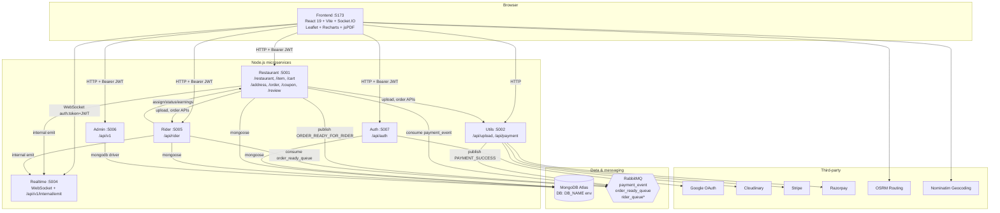

> `rider_queue` is asserted in RabbitMQ config but has **no producer/consumer** yet.

---

## 2. MongoDB — collections & ownership

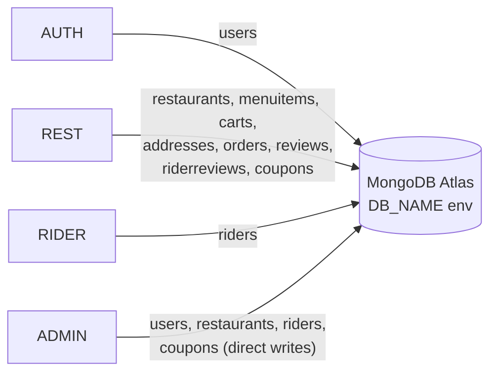

| Collection | Primary Service | Key Fields / Indexes |
|------------|-----------------|----------------------|
| `users` | Auth, Admin | email, role, **isBanned** |
| `restaurants` | Restaurant, Admin | autoLocation (**2dsphere**), isOpen, isVerified, **avgRating**, reviewCount |
| `menuitems` | Restaurant | restaurantId, name, price, image, isAvailable |
| `carts` | Restaurant | userId + restaurantId + itemId (compound unique) |
| `addresses` | Restaurant | location (**2dsphere**), formattedAddress |
| `orders` | Restaurant (+ Rider via HTTP) | status, payment, coupon, rider, distance, riderAmount, **expiresAt TTL** |
| `riders` | Rider, Admin | location (**2dsphere**), isVerified, isAvailble, **avgRating**, reviewCount |
| `reviews` | Restaurant | restaurantId, orderId (**unique**), rating 1–5 |
| `riderreviews` | Restaurant | riderId, orderId (**unique**), rating 1–5 |
| `coupons` | Restaurant (read), Admin (CRUD) | code, type, value, limits, expiresAt, isActive, usedCount |

---

## 3. Auth service

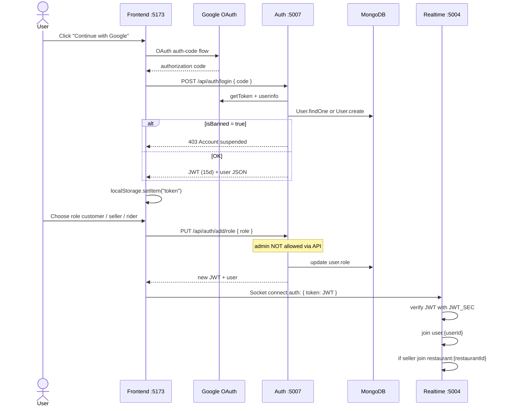

| Method | Path | Auth | Description |
|--------|------|------|-------------|
| POST | `/api/auth/login` | — | Google OAuth login |
| PUT | `/api/auth/add/role` | JWT | Assign customer / seller / rider |
| GET | `/api/auth/me` | JWT | Profile + ban check |

> **Note:** Auth port is **5007** locally (macOS AirPlay blocks 5000). `frontend/src/main.tsx` points to `:5007`.

---

## 4. Payment flow

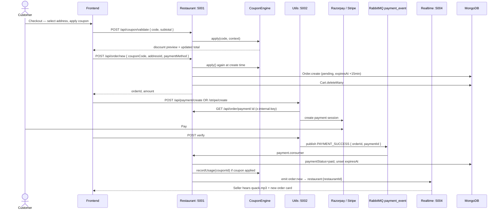

**Fee model (order creation):**

| Fee | Rule |
|-----|------|
| Delivery | ₹49 if subtotal < ₹250, else ₹0 |
| Platform | ₹7 |
| Discount | CouponEngine result |
| Rider payout | `ceil(distance_km) × ₹17` |

---

## 5. Order lifecycle

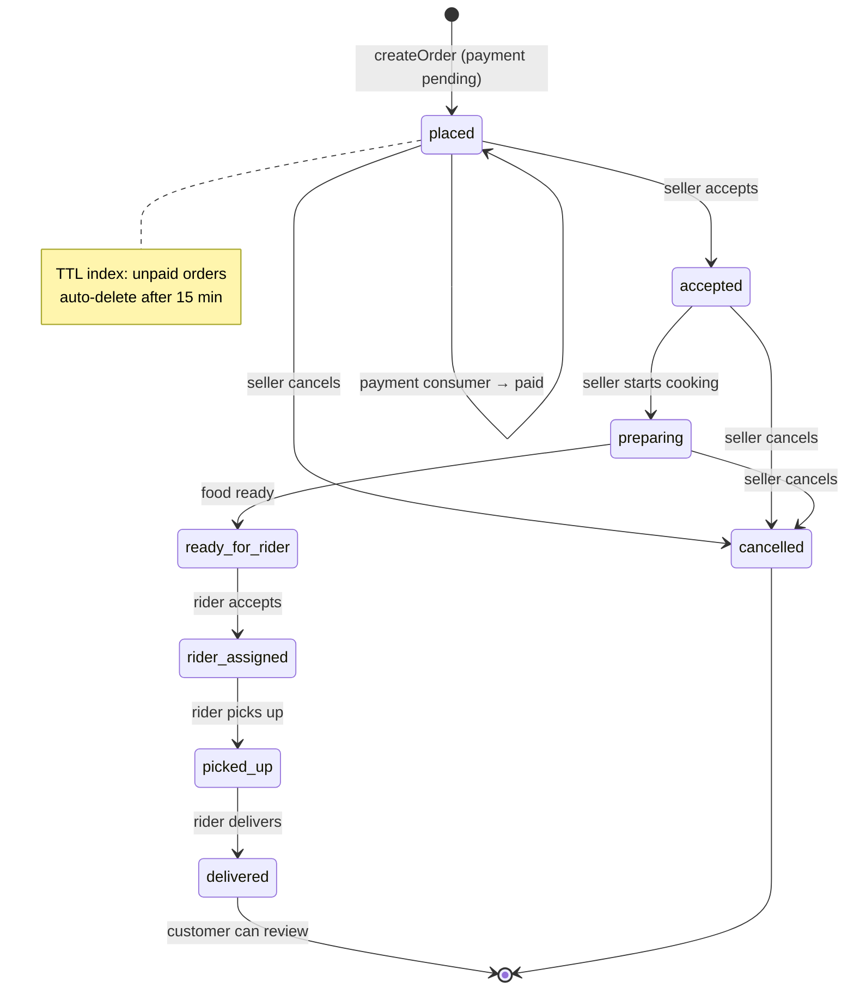

### Seller status update

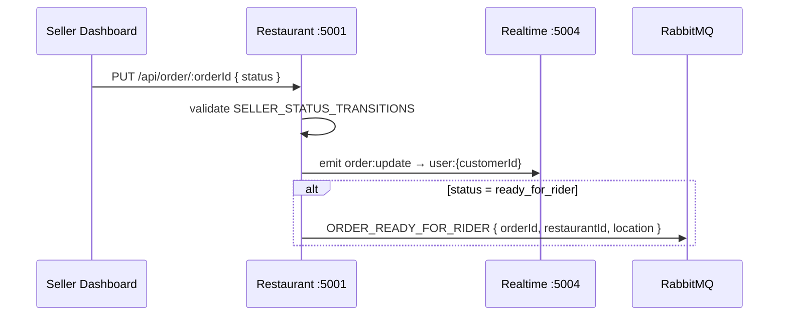

**Allowed seller transitions:**

| From | To |
|------|-----|
| `placed` | `accepted`, `cancelled` |
| `accepted` | `preparing`, `cancelled` |
| `preparing` | `ready_for_rider`, `cancelled` |

---

## 6. Smart rider dispatch

Previously all nearby riders received `order:available` simultaneously. **Current implementation:** sequential nearest-first dispatch with 10-second accept window per rider.

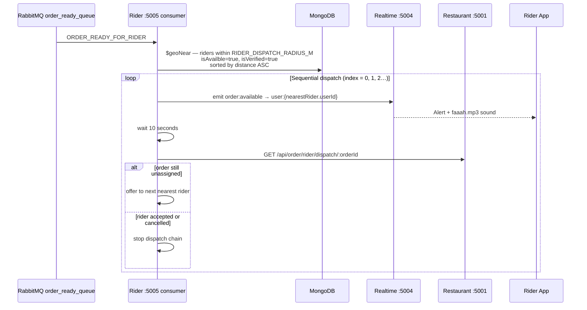

| Parameter | Value |
|-----------|-------|
| Search radius | `RIDER_DISPATCH_RADIUS_M` env (default **5000m** locally) |
| Offer timeout | 10 seconds per rider |
| Sort order | Nearest first (`$geoNear` + `$sort distance ASC`) |
| Requirements | `isVerified: true`, `isAvailble: true`, valid GeoJSON `location` |

---

## 7. Rider delivery & earnings

### Accept & deliver

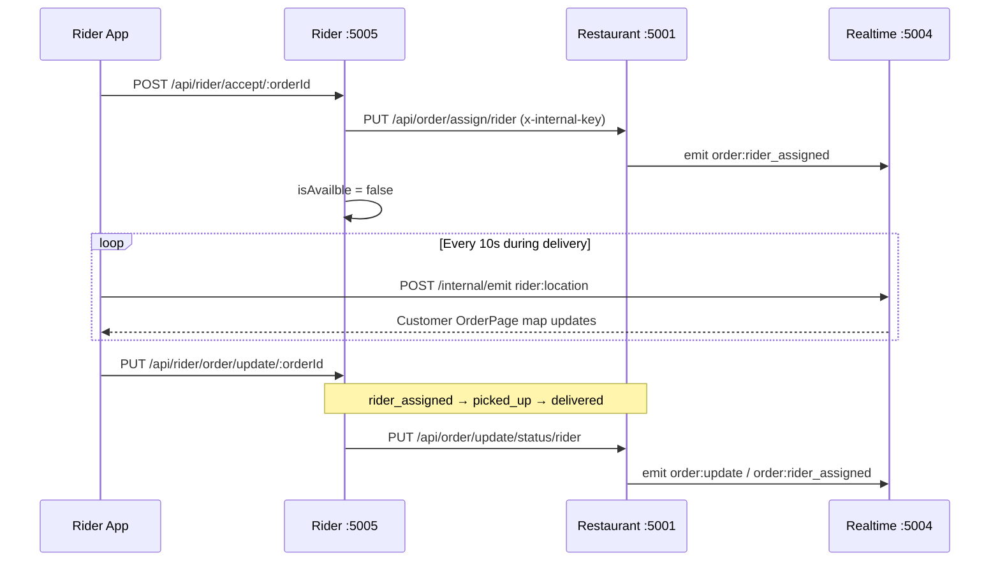

### Earnings data flow

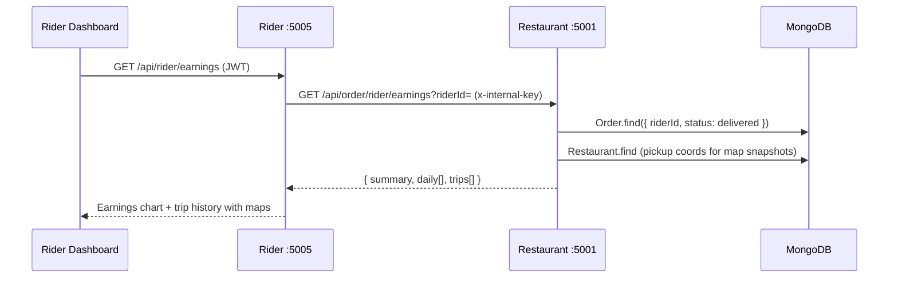

---

## 8. Coupon & discount engine (LLD)

**Location:** `services/restaurant/src/coupon/`

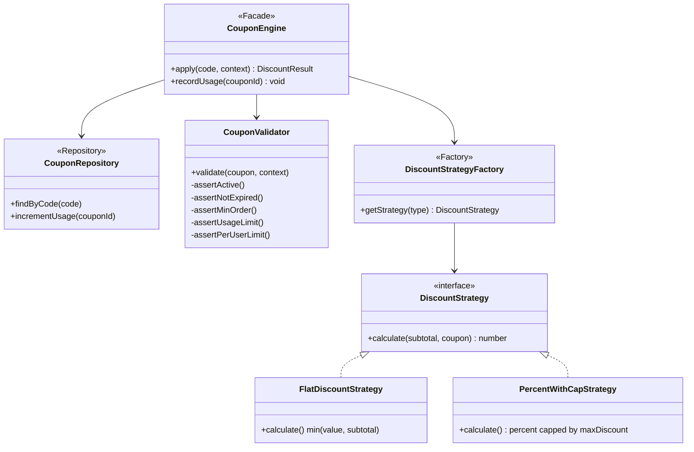

### Coupon types

| Type | Algorithm | Example |
|------|-----------|---------|
| `flat` | `min(coupon.value, subtotal)` | `FLAT50` → ₹50 off |
| `percent_cap` | `(subtotal × value / 100)` capped by `maxDiscount` | `SAVE20` → 20% off, max ₹100 |

### Validation chain

1. `isActive === true`
2. `expiresAt > now`
3. `subtotal >= minOrderAmount`
4. `usedCount < usageLimit` (if limit set)
5. Per-user paid order count with same `couponId < perUserLimit`

### Admin → Engine integration

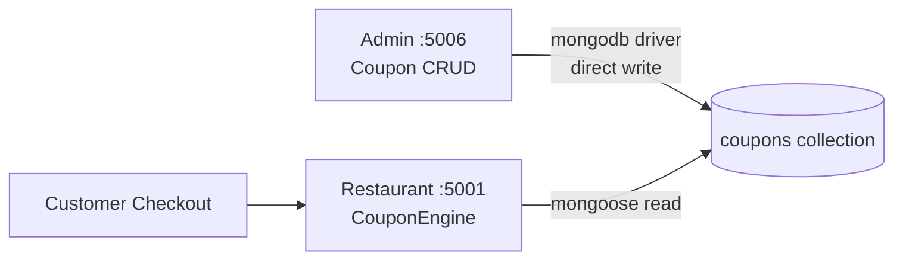

Admin creates/edits coupons directly in MongoDB. Restaurant service reads the same collection at apply time — no HTTP between Admin and Restaurant for coupons.

---

## 9. Dynamic ETA system

**Location:** `frontend/src/utils/eta.ts`

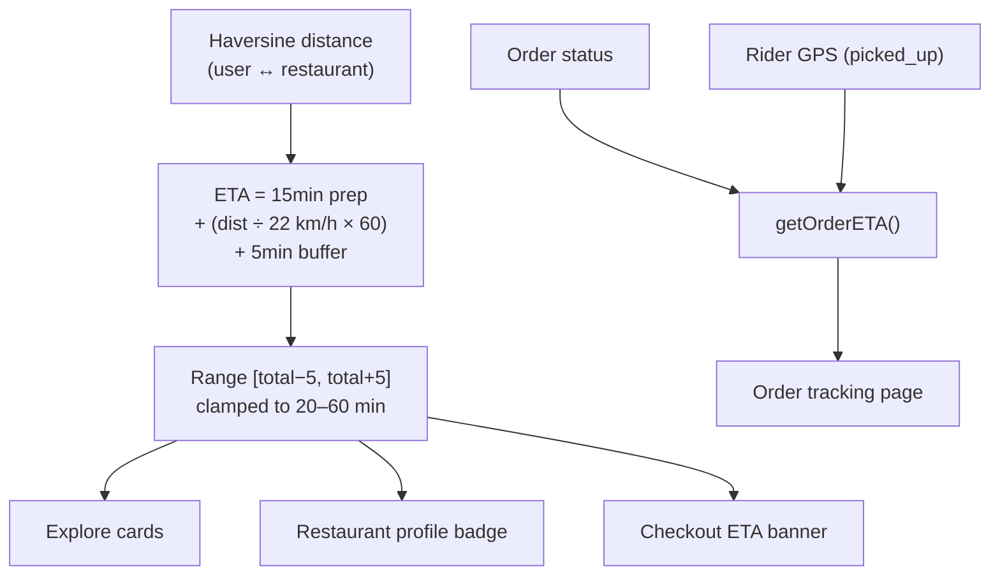

| Constant | Value |
|----------|-------|
| `AVG_RIDER_SPEED_KMH` | 22 |
| `BASE_PREP_MINUTES` | 15 |
| `ETA_BUFFER_MINUTES` | 5 |
| Min / Max display | 20 / 60 min |

| Order Status | ETA behaviour |
|--------------|---------------|
| `placed` / `accepted` | Full estimated range |
| `preparing` | ~70% of midpoint |
| `ready_for_rider` | Travel + 8 min |
| `rider_assigned` | Travel + 6 min |
| `picked_up` | Live rider → customer distance |
| `delivered` / `cancelled` | Final label |

---

## 10. Reviews & ratings

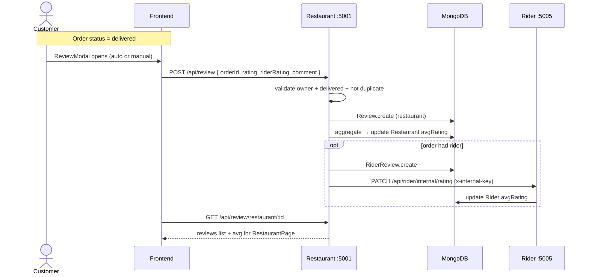

| Collection | Unique constraint | Aggregated on |
|------------|--------------------|--------------| 
| `reviews` | one per `orderId` | `restaurants.avgRating` |
| `riderreviews` | one per `orderId` | `riders.avgRating` |

---

## 11. Realtime — Socket.IO

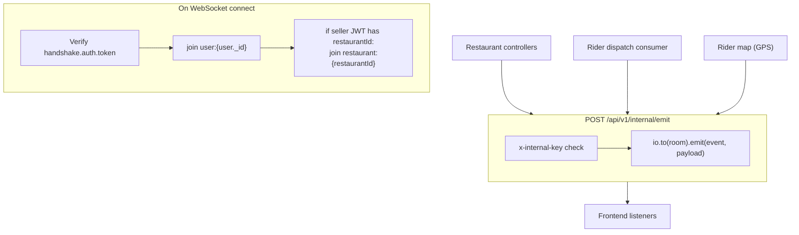

| Socket event | Emitted from | Room | Frontend |
|--------------|--------------|------|----------|
| `order:new` | Restaurant payment consumer | `restaurant:{restaurantId}` | `RestaurantOrders.tsx` |
| `order:update` | Restaurant status change | `user:{customerId}` | `Orders.tsx`, `OrderPage.tsx` |
| `order:rider_assigned` | Assign rider / status update | `user:{customerId}`, `restaurant:{id}` | Orders, OrderPage, Seller |
| `order:available` | Rider dispatch consumer | `user:{riderUserId}` | `RiderDashboard.tsx` |
| `rider:location` | Rider frontend → internal emit | `user:{customerUserId}` | `OrderPage.tsx` map |

**Connection:** `io("http://localhost:5004", { auth: { token: JWT } })`

---

## 12. Utils service

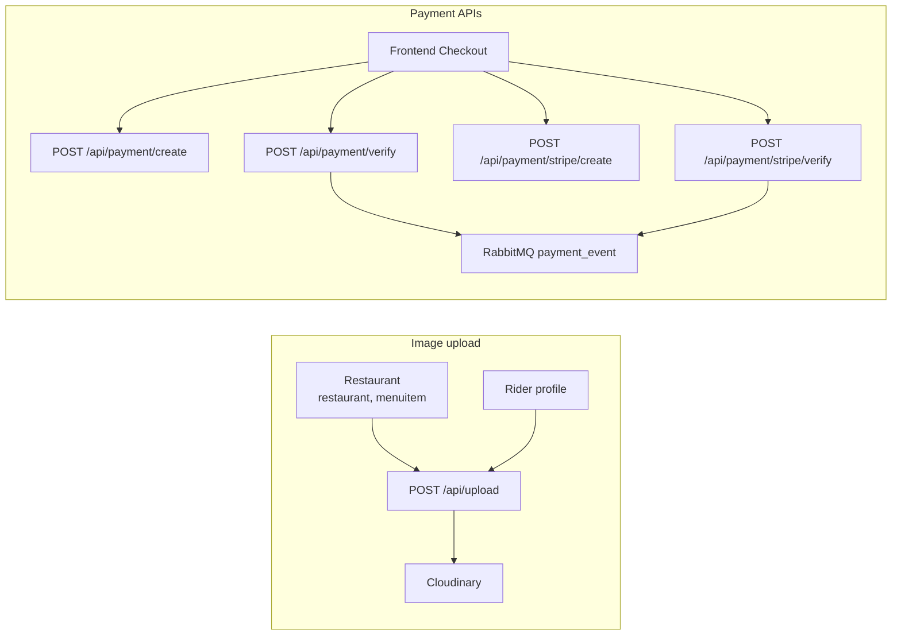

Utils **requires** Cloudinary env vars at startup or it throws.

---

## 13. Admin service

Admin uses the **native MongoDB driver** — no Mongoose, no inter-service HTTP.

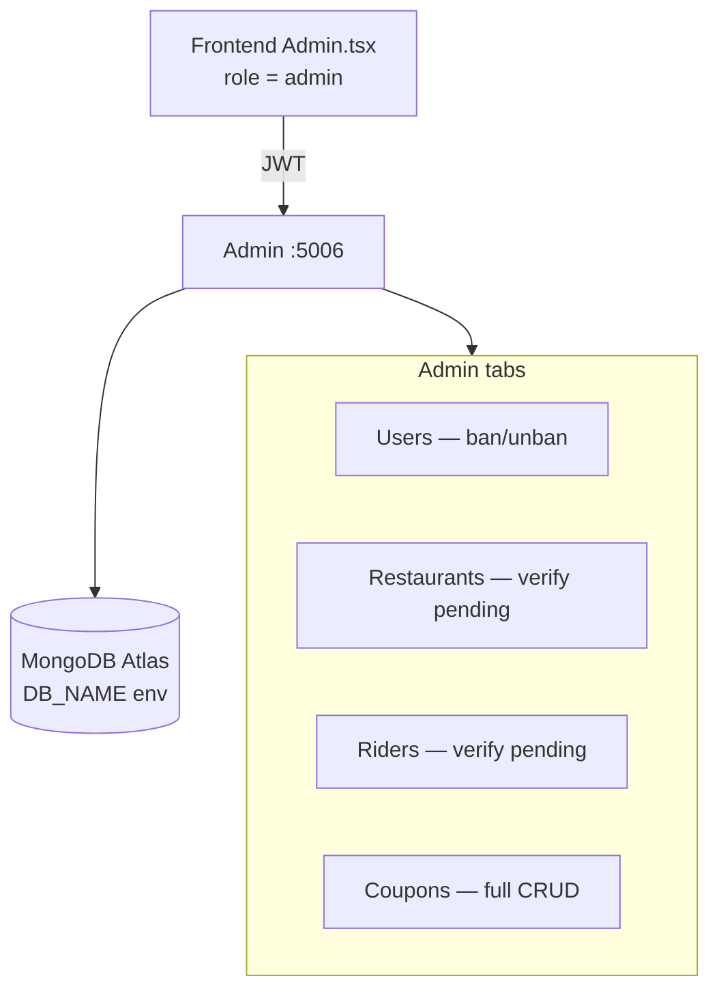

| Method | Path | Description |
|--------|------|-------------|
| GET | `/api/v1/admin/users` | List users (max 100) |
| PATCH | `/api/v1/admin/users/:id/status` | Ban / unban (self-ban blocked) |
| GET | `/api/v1/admin/restaurant/pending` | Unverified restaurants |
| PATCH | `/api/v1/verify/restaurant/:id` | Set `isVerified: true` |
| GET | `/api/v1/admin/rider/pending` | Unverified riders |
| PATCH | `/api/v1/verify/rider/:id` | Set `isVerified: true` |
| GET | `/api/v1/admin/coupons` | List all coupons |
| POST | `/api/v1/admin/coupon` | Create coupon |
| PATCH | `/api/v1/admin/coupon/:id` | Update coupon fields |
| PATCH | `/api/v1/admin/coupon/:id/toggle` | Toggle `isActive` |
| DELETE | `/api/v1/admin/coupon/:id` | Delete coupon |

**Admin role setup:** Set `role: "admin"` manually in MongoDB — not available via `PUT /api/auth/add/role`.

---

## 14. Restaurant API map

| Prefix | Routes | Auth |
|--------|--------|------|
| `/api/restaurant` | POST `/new`, GET `/my`, GET `/all`, PUT `/status`, PUT `/edit`, GET `/:id` | JWT / seller |
| `/api/item` | POST `/new`, GET `/all/:id`, PUT `/:itemId`, DELETE `/:itemId`, PUT `/status/:itemId` | JWT / seller |
| `/api/cart` | POST `/add`, GET `/all`, PUT `/inc`, PUT `/dec`, DELETE `/clear` | JWT |
| `/api/address` | POST `/new`, GET `/all`, DELETE `/:id` | JWT |
| `/api/order` | POST `/new`, GET `/myorder`, GET `/:id`, PUT `/:orderId`, GET `/analytics/:restaurantId` | JWT / seller |
| `/api/coupon` | POST `/validate` | JWT |
| `/api/review` | POST `/`, GET `/my`, GET `/restaurant/:id`, GET `/rider/:id` | JWT |

**Internal routes** (`x-internal-key`, no JWT):

| Method | Path | Called by |
|--------|------|-----------|
| GET | `/api/order/payment/:id` | Utils |
| PUT | `/api/order/assign/rider` | Rider |
| GET | `/api/order/current/rider` | Rider |
| PUT | `/api/order/update/status/rider` | Rider |
| GET | `/api/order/rider/earnings` | Rider |
| GET | `/api/order/rider/dispatch/:orderId` | Rider dispatch consumer |

---

## 15. RabbitMQ queues

| Queue | Env var | Publisher | Consumer | Event | Effect |
|-------|---------|-----------|----------|-------|--------|
| `payment_event` | `PAYMENT_QUEUE` | Utils | Restaurant | `PAYMENT_SUCCESS` | Mark paid, coupon usage++, notify seller |
| `order_ready_queue` | `ORDER_READY_QUEUE` | Restaurant | Rider | `ORDER_READY_FOR_RIDER` | Sequential nearest-rider dispatch |

> **Boot assertion:** Both Restaurant and Rider services assert `order_ready_queue` at startup. Restaurant must assert before publishing when seller marks order `ready_for_rider`.
| `rider_queue` | `RIDER_QUEUE` | — | — | — | Asserted only, unused |

---

## 16. Shared secrets & ports

### Ports

| Service | Port | Notes |
|---------|------|-------|
| Frontend | 5173 | Vite dev server |
| Auth | **5007** | Not 5000 (macOS AirPlay conflict) |
| Restaurant | 5001 | RabbitMQ consumer at boot |
| Utils | 5002 | Cloudinary required |
| Realtime | 5004 | Socket.IO |
| Rider | 5005 | RabbitMQ consumer at boot |
| Admin | 5006 | Native MongoDB driver |
| RabbitMQ | 5672 | AWS EC2 Docker (production) or local Docker |

### Secrets (must be identical)

| Variable | Used by |
|----------|---------|
| `JWT_SEC` | Auth, Restaurant, Rider, Realtime, Admin |
| `INTERNAL_SERVICE_KEY` | Restaurant, Utils, Realtime, Rider + `VITE_INTERNAL_SERVICE_KEY` in frontend |

---

## 17. Startup order

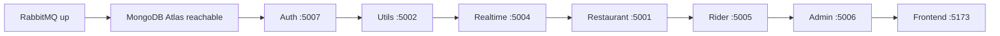

Each backend service: `npm run dev` → `tsc --watch` + `node --watch dist/index.js`.

---

## 18. Cloud deployment

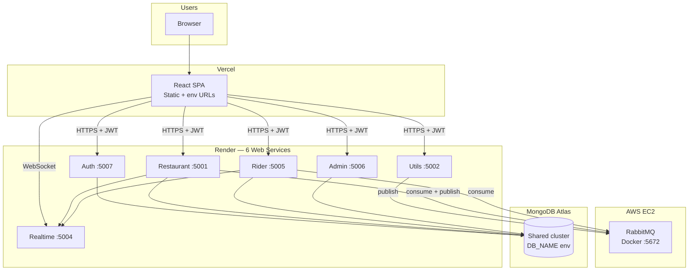

| Layer | Platform | Role |
|-------|----------|------|
| Frontend | Vercel | SPA hosting, env vars for service URLs |
| Backend ×6 | Render | One web service per microservice |
| Message broker | AWS EC2 + Docker | RabbitMQ (`payment_event`, `order_ready_queue`) |
| Database | MongoDB Atlas M0 | Shared cluster across services |
| Media | Cloudinary | Restaurant/menu/rider images |
| Payments | Razorpay + Stripe | Test/live keys in Utils `.env` |

**Demo:** [Google Drive video](https://drive.google.com/file/d/1dFfNB1KGfTNGw0WirO0h5zulQg5hJMcx/view?usp=drive_link) · **Repo:** [github.com/subhm2004/ByteBites](https://github.com/subhm2004/ByteBites)

---

## 19. Known limitations

| Area | Limitation |
|------|------------|
| **Database** | Shared MongoDB cluster — not database-per-service |
| **Rider dispatch** | Nearest-first within `RIDER_DISPATCH_RADIUS_M`; no batching |
| **Real-time** | Single Realtime instance — no Redis Socket.IO adapter |
| **Notifications** | In-app sockets only — no FCM/APNs |
| **ETA** | Haversine rule-based — not live traffic / ML |
| **Refunds** | Cancel UI only — no automated gateway refund |
| **Admin** | Role set manually in MongoDB |
| **Testing** | No CI integration/E2E suite |
| **Unused queue** | `rider_queue` asserted but unused |

See [README.md — Known Limitations](./README.md#known-limitations) for full detail.

---

## Role-based UI routing

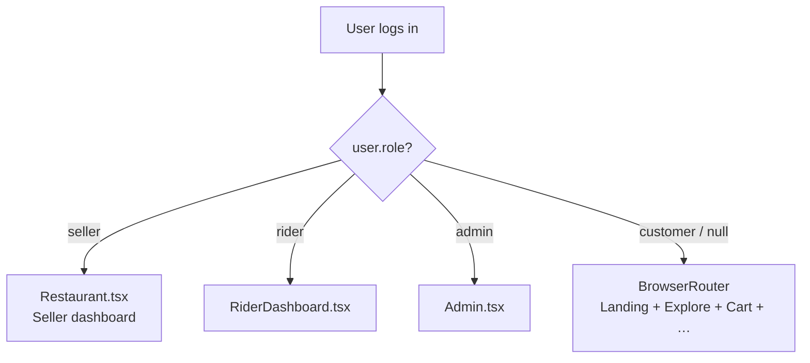

---
