# ByteBites — System Architecture

> Diagrams match the **actual codebase**. View in Cursor/GitHub (Mermaid preview) or paste into [mermaid.live](https://mermaid.live).

---

## 1. High-level system (all services + externals)

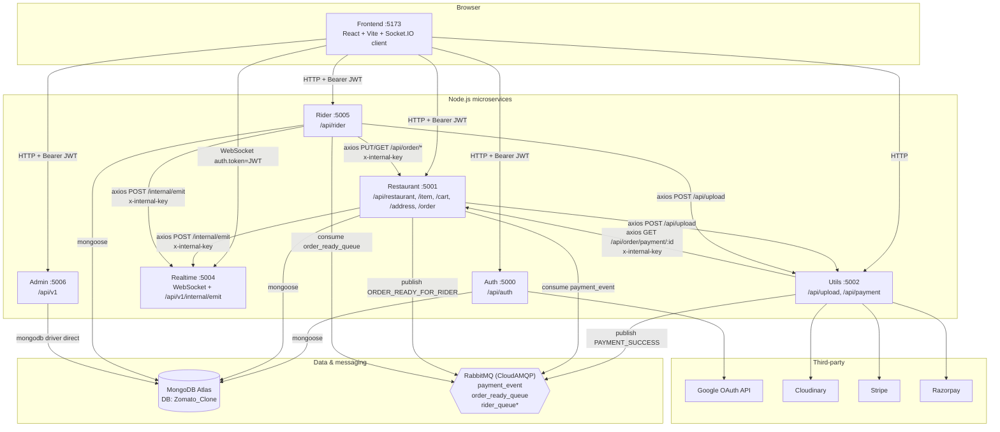

> `rider_queue` is asserted in RabbitMQ config but has **no producer/consumer** in code yet.

---

## 2. MongoDB — who uses what

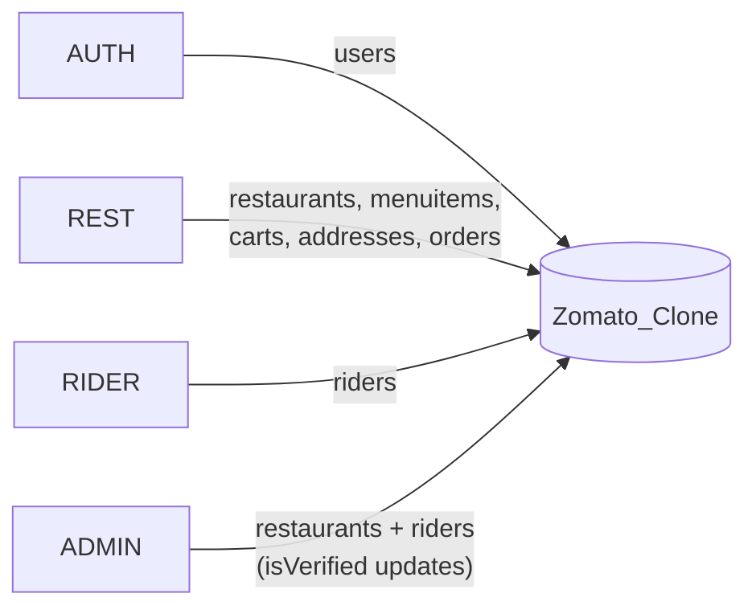

| Collection | Service | Operations |
|------------|---------|------------|
| `users` | Auth | create on Google login, role update |
| `restaurants` | Restaurant, Admin | CRUD + Admin sets `isVerified` |
| `menuitems` | Restaurant | seller menu |
| `carts` | Restaurant | add / inc / dec / clear |
| `addresses` | Restaurant | delivery addresses |
| `orders` | Restaurant, Rider (via HTTP) | create, pay, status, assign rider |
| `riders` | Rider, Admin | profile + Admin sets `isVerified` |

---

## 3. Auth service — login & JWT

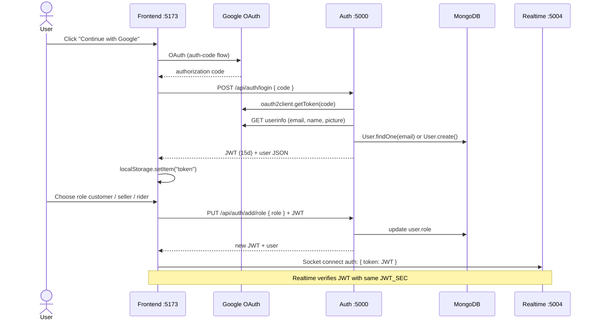

**Routes (`services/auth`):**

| Method | Path | Auth |
|--------|------|------|
| POST | `/api/auth/login` | No |
| PUT | `/api/auth/add/role` | JWT |
| GET | `/api/auth/me` | JWT |

---

## 4. Payment flow (Razorpay or Stripe)

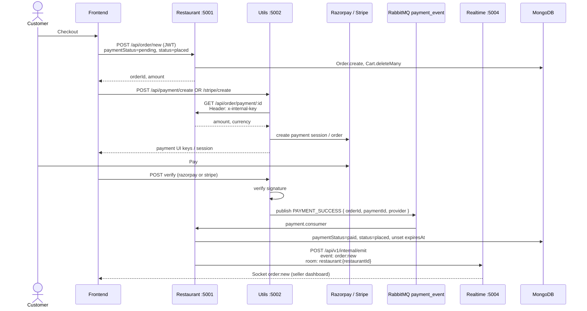

---

## 5. Order lifecycle

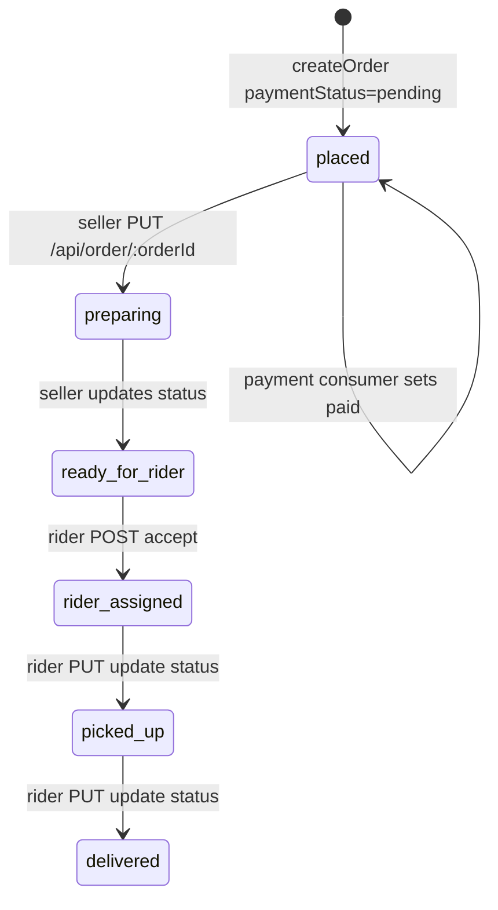

### 5a. Seller `ready_for_rider` → RabbitMQ → nearby riders

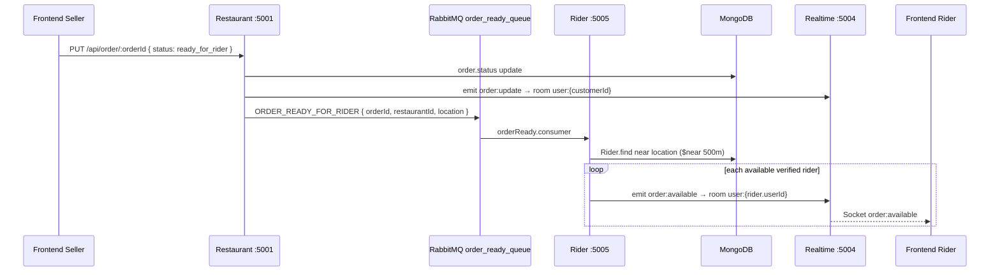

### 5b. Rider accepts order

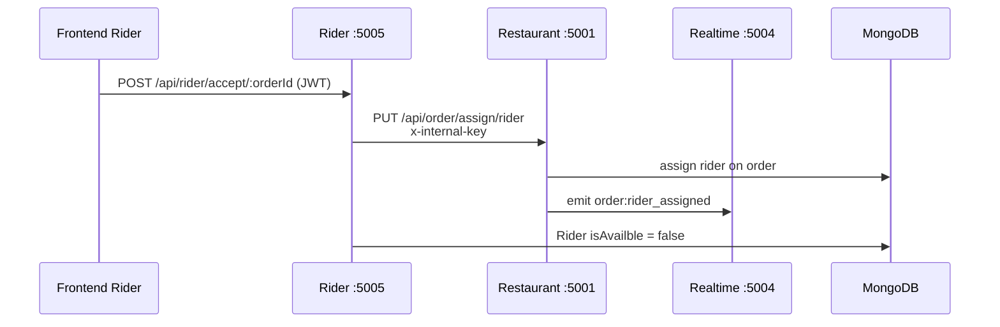

### 5c. Rider updates delivery status

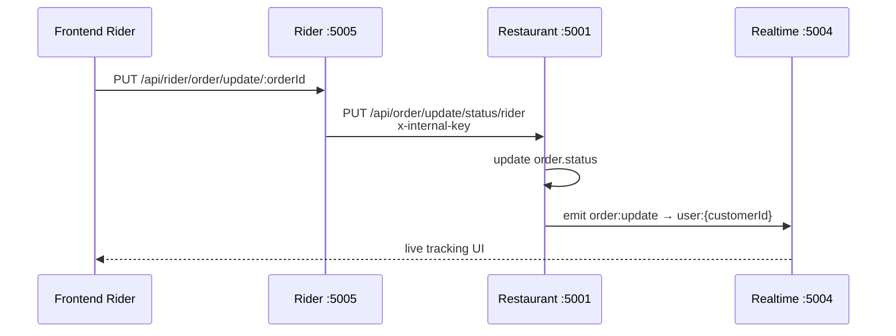

---

## 6. Realtime service — Socket rooms & internal emit

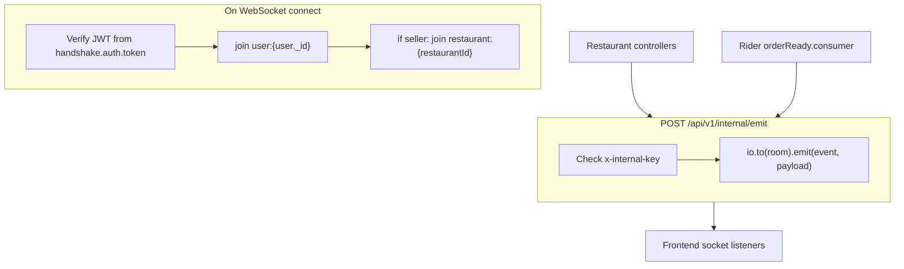

| Socket event | Emitted from | Room | Frontend file |
|--------------|--------------|------|---------------|
| `order:new` | Restaurant after payment | `restaurant:{restaurantId}` | `RestaurantOrders.tsx` |
| `order:update` | Restaurant status change | `user:{customerId}` | `Orders.tsx`, `OrderPage.tsx` |
| `order:rider_assigned` | Restaurant assign rider | customer + restaurant | `Orders.tsx`, `RestaurantOrders.tsx` |
| `order:available` | Rider consumer | `user:{rider.userId}` | `RiderDashboard.tsx` |
| `rider:location` | tracking | `OrderPage.tsx` | map updates |

---

## 7. Utils service

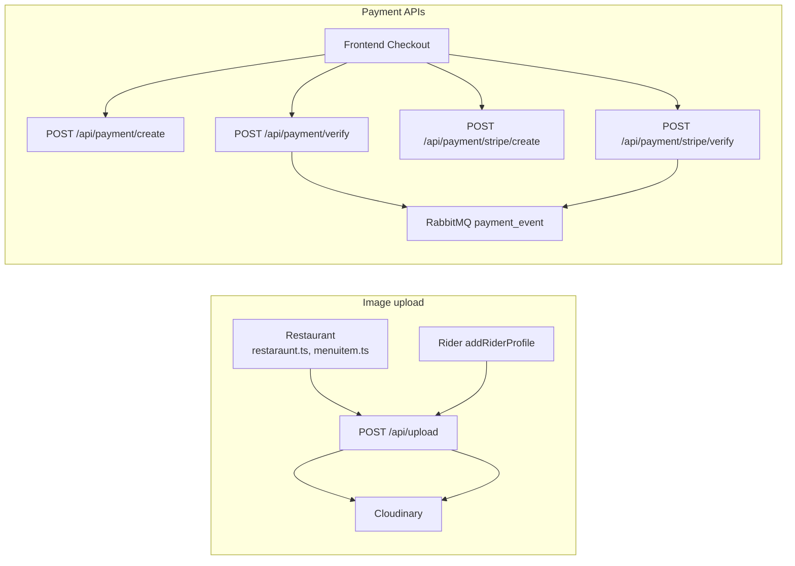

Utils **requires** Cloudinary env vars at startup or it throws.

---

## 8. Admin service

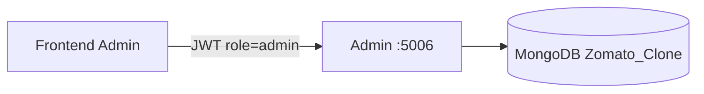

| Method | Path |
|--------|------|
| GET | `/api/v1/admin/restaurant/pending` |
| GET | `/api/v1/admin/rider/pending` |
| PATCH | `/api/v1/verify/restaurant/:id` |
| PATCH | `/api/v1/verify/rider/:id` |

Admin does **not** call other microservices — only direct MongoDB updates.

---

## 9. Restaurant API map

| Prefix | Purpose |
|--------|---------|
| `/api/restaurant` | Seller restaurant CRUD, nearby list |
| `/api/item` | Menu CRUD |
| `/api/cart` | Cart operations |
| `/api/address` | Delivery addresses |
| `/api/order` | Orders + seller status |

**Internal routes** (`x-internal-key` header):

| Method | Path | Called by |
|--------|------|-----------|
| GET | `/api/order/payment/:id` | Utils |
| PUT | `/api/order/assign/rider` | Rider |
| GET | `/api/order/current/rider` | Rider |
| PUT | `/api/order/update/status/rider` | Rider |

---

## 10. RabbitMQ queues

| Queue | Publisher | Consumer | Payload type |
|-------|-----------|----------|--------------|
| `payment_event` | Utils `publishPaymentSuccess` | Restaurant `payment.consumer` | `PAYMENT_SUCCESS` |
| `order_ready_queue` | Restaurant `publishEvent` | Rider `orderReady.consumer` | `ORDER_READY_FOR_RIDER` |
| `rider_queue` | — | — | asserted only, unused |

---

## 11. Shared secrets (must match)

| Variable | Used by |
|----------|---------|
| `JWT_SEC` | Auth, Restaurant, Rider, Admin, Realtime (socket) |
| `INTERNAL_SERVICE_KEY` | Utils, Restaurant, Rider, Realtime + `VITE_INTERNAL_SERVICE_KEY` in frontend |

---

## 12. Recommended startup order

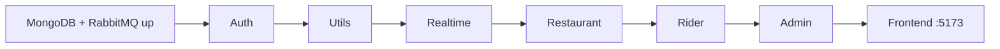

---

## Excalidraw

1. Open [excalidraw.com](https://excalidraw.com)
2. Use **Section 1** as the main canvas (boxes + arrows)
3. Use **Sections 3–5** for sequence / timeline pages
4. Export from [mermaid.live](https://mermaid.live) as PNG/SVG to import into Excalidraw

*Source: `services/*`, `frontend/src` — ByteBites repo.*
