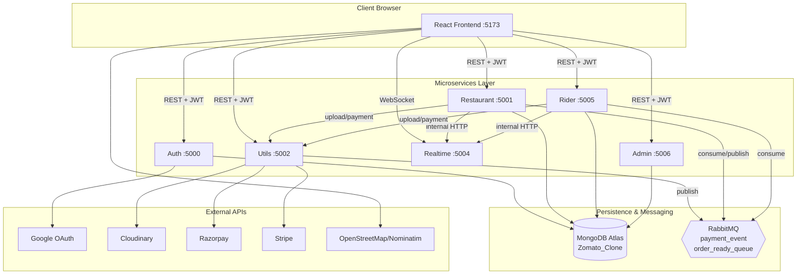
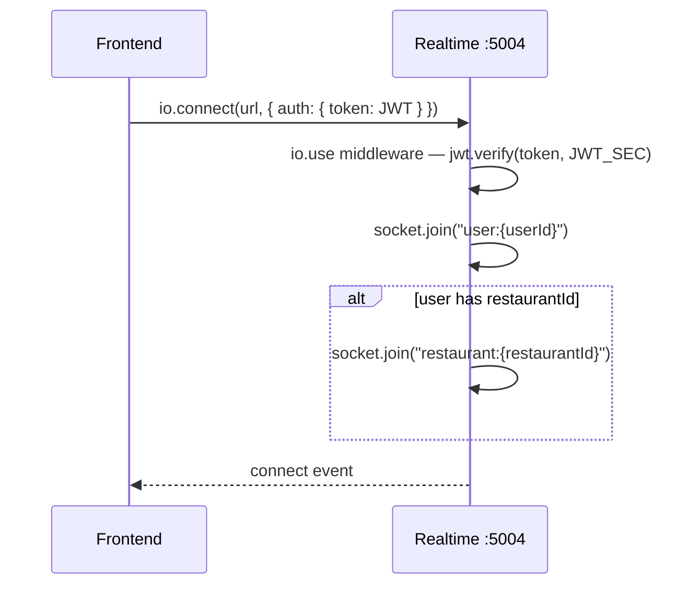
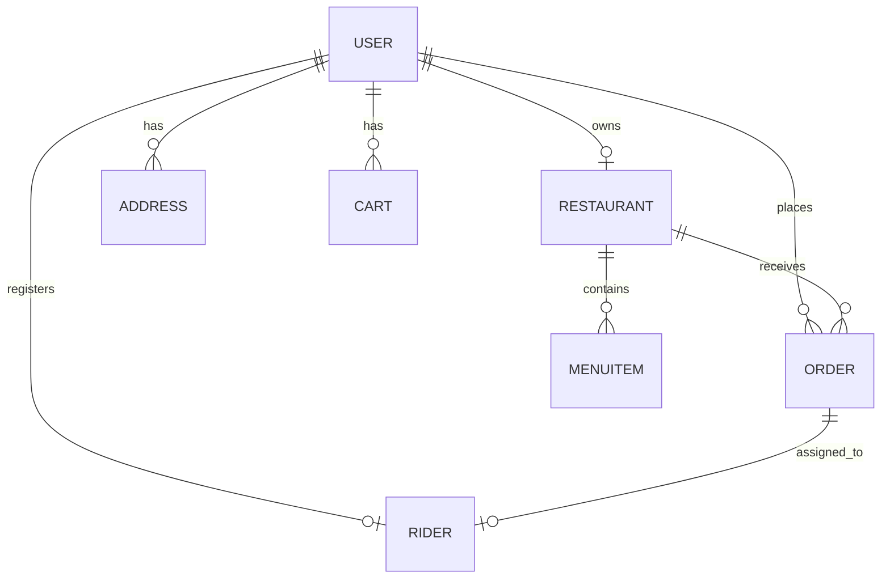
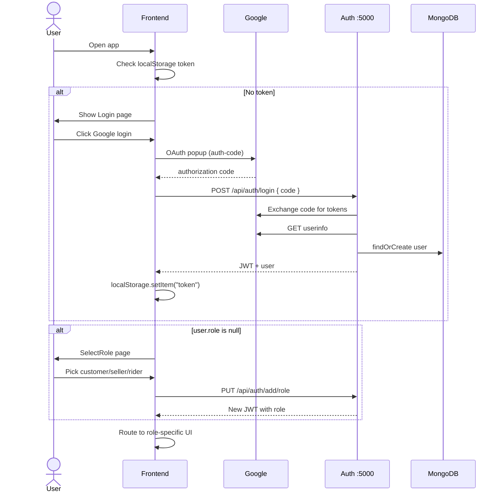
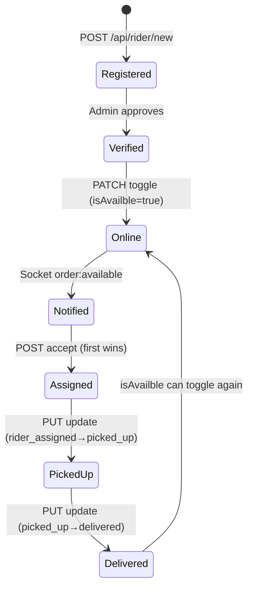
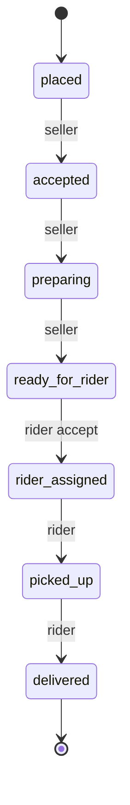

# ByteBites — Complete Project Documentation  
## Final Semester Viva | Report | Presentation Guide

---

| Field | Detail |
|-------|--------|
| **Project Title** | ByteBites — Production-Ready Food Delivery Platform |
| **Project Type** | Full-Stack Microservices Web Application |
| **Domain** | Food Tech (Zomato / Swiggy Clone) |
| **Architecture** | 6 Backend Microservices + React SPA Frontend |
| **Database** | MongoDB Atlas (Cloud) |
| **Message Broker** | RabbitMQ (CloudAMQP / AWS Docker) |
| **Reference Tutorial** | [Small Town Coder — Zomato Clone (25+ hrs)](https://www.youtube.com/watch?v=79F36yYEDyo) |
| **Related Docs** | `ARCHITECTURE.md` (technical diagrams) |

---

## Master Table of Contents

### Part A — Project Overview
1. [Abstract](#1-abstract)
2. [Introduction & Background](#2-introduction--background)
3. [Problem Statement](#3-problem-statement)
4. [Objectives](#4-objectives)
5. [Scope of Project](#5-scope-of-project)
6. [Existing System vs Proposed System](#6-existing-system-vs-proposed-system)
7. [Hardware & Software Requirements](#7-hardware--software-requirements)

### Part B — Technical Architecture
8. [Project Folder Structure](#8-project-folder-structure)
9. [Tech Stack (Detailed)](#9-tech-stack-detailed)
10. [System Architecture](#10-system-architecture)
11. [Inter-Service Communication Matrix](#11-inter-service-communication-matrix)
12. [Environment Variables (All Services)](#12-environment-variables-all-services)

### Part C — Backend Deep Dive
13. [Auth Service — Complete Breakdown](#13-auth-service--complete-breakdown)
14. [Restaurant Service — Complete Breakdown](#14-restaurant-service--complete-breakdown)
15. [Utils Service — Complete Breakdown](#15-utils-service--complete-breakdown)
16. [Realtime Service — Complete Breakdown](#16-realtime-service--complete-breakdown)
17. [Rider Service — Complete Breakdown](#17-rider-service--complete-breakdown)
18. [Admin Service — Complete Breakdown](#18-admin-service--complete-breakdown)
19. [Middleware & Design Patterns](#19-middleware--design-patterns)
20. [Database Design (Full Schema)](#20-database-design-full-schema)

### Part D — Frontend Deep Dive
21. [Frontend Architecture](#21-frontend-architecture)
22. [Page-by-Page Breakdown](#22-page-by-page-breakdown)
23. [State Management & Context](#23-state-management--context)
24. [Routing & Role-Based UI](#24-routing--role-based-ui)

### Part E — Core Flows
25. [Flow 1: Authentication & Role Selection](#25-flow-1-authentication--role-selection)
26. [Flow 2: Customer Order (End-to-End)](#26-flow-2-customer-order-end-to-end)
27. [Flow 3: Payment (Razorpay + Stripe)](#27-flow-3-payment-razorpay--stripe)
28. [Flow 4: Seller Order Management](#28-flow-4-seller-order-management)
29. [Flow 5: Rider Delivery Lifecycle](#29-flow-5-rider-delivery-lifecycle)
30. [Flow 6: Admin Verification](#30-flow-6-admin-verification)
31. [Order Status State Machine](#31-order-status-state-machine)

### Part F — Infrastructure
32. [RabbitMQ — Deep Dive](#32-rabbitmq--deep-dive)
33. [Socket.IO — Deep Dive](#33-socketio--deep-dive)
34. [Payment Security](#34-payment-security)
35. [Security & Authentication](#35-security--authentication)
36. [Deployment Strategy](#36-deployment-strategy)
37. [Local Setup Guide (Summary)](#37-local-setup-guide-summary)

### Part G — Viva Preparation
38. [Tutorial Video Chapter Mapping](#38-tutorial-video-chapter-mapping)
39. [Complete API Reference](#39-complete-api-reference)
40. [Glossary of Terms](#40-glossary-of-terms)
41. [Limitations](#41-limitations)
42. [Future Enhancements](#42-future-enhancements)
43. [Viva Demo Script (10 minutes)](#43-viva-demo-script-10-minutes)
44. [Presentation Tips (Hindi)](#44-presentation-tips-hindi)
45. [50+ Viva Questions & Answers](#45-50-viva-questions--answers)
46. [Code Files to Show Examiner](#46-code-files-to-show-examiner)
47. [Conclusion](#47-conclusion)

---

# PART A — PROJECT OVERVIEW

---

## 1. Abstract

**ByteBites** is a full-stack, production-style **food delivery web application** modeled after industry platforms such as **Zomato** and **Swiggy**. Unlike typical college projects that use a single monolithic backend, this system implements a **microservices architecture** with **six independent Node.js/Express services**, each deployed on its own port and responsible for a distinct business domain.

The platform supports **four distinct user personas** — Customer, Restaurant Seller, Delivery Partner (Rider), and Platform Admin — each with a dedicated user interface and API access pattern. Core capabilities include **Google OAuth authentication**, **JWT-based authorization**, **geospatial restaurant discovery**, **shopping cart and checkout**, **dual payment gateway integration** (Razorpay for India, Stripe for international), **asynchronous event processing** via **RabbitMQ message queues**, and **real-time bidirectional communication** using **Socket.IO** with **Leaflet map-based live tracking**.

The project demonstrates practical implementation of distributed systems concepts: service decomposition, message-oriented middleware, stateless authentication, internal service security, cloud database hosting, and third-party API integration — making it suitable for final-year computer science viva, project report, and technical interview discussions.

---

## 2. Introduction & Background

### 2.1 Industry Context

Food delivery is a **multi-sided marketplace** connecting three parties:
- **Customers** who want food delivered
- **Restaurants** who prepare food
- **Delivery partners** who transport food

Platforms like Zomato process thousands of orders per minute. Their systems must handle:
- Concurrent user sessions (millions)
- Payment processing (PCI compliance)
- Real-time GPS tracking
- Order state management across multiple actors
- Notification systems

Building such a system as a learning project teaches **system design**, not just CRUD operations.

### 2.2 What This Project Is

This project is a **functional prototype** of that industry model, built following the comprehensive tutorial by **Small Town Coder** (YouTube, 25+ hours). It is branded as **ByteBites** throughout the UI and documentation.

### 2.3 What Makes This Project "Advanced" for Viva

| Feature | Typical College Project | This Project |
|---------|------------------------|--------------|
| Backend | Single Express app | 6 microservices |
| Communication | Direct function calls | HTTP + RabbitMQ + WebSocket |
| Auth | Email/password | Google OAuth + JWT |
| Payments | Mock/fake | Razorpay + Stripe (real SDKs) |
| Real-time | Polling/refresh | Socket.IO push events |
| Maps | None | Leaflet geolocation + routing |
| Images | Local upload | Cloudinary CDN |
| Database | Local MongoDB | MongoDB Atlas cloud |
| Roles | Single user type | 4 role-based dashboards |

---

## 3. Problem Statement

**Problem:** Traditional single-server food ordering applications fail to demonstrate how real-world delivery platforms handle scale, fault tolerance, asynchronous processing, and multi-role workflows.

**Specific gaps in simple projects:**
1. Payment verification blocking the main order thread
2. No real-time updates — users must refresh the page
3. Rider assignment done manually or synchronously
4. All logic in one file — unmaintainable beyond demo scale
5. No admin moderation for restaurants/riders
6. No geospatial queries for nearby discovery

**Solution:** Design and implement **ByteBites** — a microservices-based food delivery platform with message queues, WebSocket notifications, dual payment gateways, geospatial MongoDB queries, and role-separated frontend dashboards.

---

## 4. Objectives

### 4.1 Primary Objectives

| # | Objective | Implementation |
|---|-----------|----------------|
| 1 | Microservices architecture | 6 independent Express services |
| 2 | Secure authentication | Google OAuth 2.0 + JWT (15-day expiry) |
| 3 | Role-based access control | customer, seller, rider, admin |
| 4 | Restaurant & menu management | Restaurant service + Cloudinary uploads |
| 5 | Cart & checkout | MongoDB cart with compound unique index |
| 6 | Address management | GeoJSON Point storage with 2dsphere index |
| 7 | Order lifecycle | 8 status states with business rules |
| 8 | Async payment confirmation | RabbitMQ `payment_event` queue |
| 9 | Async rider dispatch | RabbitMQ `order_ready_queue` |
| 10 | Real-time notifications | Socket.IO with room-based targeting |
| 11 | Live map tracking | Leaflet + OpenStreetMap + routing |
| 12 | Admin moderation | Verify restaurants and riders |
| 13 | Dual payment support | Razorpay (INR) + Stripe (global) |
| 14 | Cloud deployment readiness | Env-based config, Vercel + Render |

### 4.2 Learning Outcomes

After completing this project, a student can explain:
- Difference between monolithic and microservices architecture
- How message queues decouple services
- JWT authentication flow
- WebSocket vs HTTP polling
- Geospatial indexing in MongoDB
- Payment gateway integration and signature verification
- Role-based frontend routing

---

## 5. Scope of Project

### 5.1 In Scope ✅

- Google OAuth login (auth-code flow via `@react-oauth/google`)
- Role selection after first login
- Customer: browse, search, cart, address, checkout, pay, track
- Seller: restaurant CRUD, menu CRUD, open/close toggle, live orders, status updates, sound notification on new order
- Rider: profile registration, online/offline toggle, GPS location, order accept, map navigation, status updates
- Admin: pending list, one-click verify
- Razorpay and Stripe test-mode payments
- RabbitMQ async messaging
- Socket.IO real-time events
- MongoDB Atlas cloud database
- Image upload via Cloudinary

### 5.2 Out of Scope ❌

- Native Android/iOS apps
- Email/SMS/push notifications (FCM)
- Coupon/discount engine (not in current codebase)
- Rating and reviews
- Multi-restaurant single cart
- Wallet / cash on delivery
- Automated CI/CD pipeline
- Kubernetes orchestration
- Unit/integration test suite

---

## 6. Existing System vs Proposed System

### 6.1 Existing (Manual / Phone Order)

```
Customer → Phone call to restaurant → Cash payment → No tracking
```

**Problems:** No online menu, no digital payment, no live tracking, no rider management, no scalability.

### 6.2 Proposed (ByteBites Platform)

```
Customer App ──► Microservices Backend ──► MongoDB
                      │
                      ├── RabbitMQ (async events)
                      ├── Socket.IO (live updates)
                      ├── Cloudinary (images)
                      └── Razorpay/Stripe (payments)
```

**Advantages:** Digital workflow, real-time tracking, automated rider matching, online payments, admin moderation, scalable architecture.

---

## 7. Hardware & Software Requirements

### 7.1 Development Machine

| Component | Minimum | Recommended |
|-----------|---------|-------------|
| RAM | 8 GB | 16 GB |
| Storage | 5 GB free | 10 GB |
| OS | Windows 10 / macOS / Linux | macOS or Ubuntu |
| Browser | Chrome (latest) | Chrome with location enabled |
| Internet | Required | Required (cloud DB, OAuth, payments) |

### 7.2 Software

| Software | Version | Purpose |
|----------|---------|---------|
| Node.js | 20+ (22+ recommended) | Runtime for all services |
| npm | 9+ | Package manager |
| VS Code / Cursor | Latest | IDE |
| MongoDB Atlas account | Free M0 | Cloud database |
| CloudAMQP account | Free tier | Cloud RabbitMQ |
| Google Cloud Console | Free | OAuth credentials |
| Cloudinary account | Free | Image hosting |
| Razorpay account | Test mode | Indian payments |
| Stripe account | Test mode | Global payments |
| Git | Any | Version control |

### 7.3 Running Services (Local)

When fully running locally, **7 processes** are active:

| Process | Port |
|---------|------|
| Auth | 5000 |
| Restaurant | 5001 |
| Utils | 5002 |
| Realtime | 5004 |
| Rider | 5005 |
| Admin | 5006 |
| Frontend (Vite) | 5173 |

---

# PART B — TECHNICAL ARCHITECTURE

---

## 8. Project Folder Structure

```
ByteBites/
├── ARCHITECTURE.md              # Mermaid technical diagrams
├── VIVA_DOCUMENTATION.md        # This file
├── .gitignore                   # Ignores node_modules, .env, dist
│
├── frontend/                    # React + Vite + TypeScript
│   ├── src/
│   │   ├── pages/               # Route pages (Login, Home, Cart, etc.)
│   │   ├── components/          # Reusable UI components
│   │   ├── context/             # AppContext, SocketContext
│   │   ├── utils/               # orderflow.ts helpers
│   │   ├── assets/              # quack.mp3 notification sound
│   │   ├── App.tsx              # Root router + role switching
│   │   └── main.tsx             # Service URLs, Google provider
│   ├── package.json
│   └── vercel.json              # Vercel deployment config
│
└── services/
    ├── auth/                    # Port 5000 — Login, JWT, roles
    │   └── src/
    │       ├── controllers/auth.ts
    │       ├── middlewares/isAuth.ts, trycatch.ts
    │       ├── model/User.ts
    │       ├── config/db.ts, googleConfig.ts
    │       └── routes/auth.ts
    │
    ├── restaurant/              # Port 5001 — Core business logic
    │   └── src/
    │       ├── controllers/     # order, cart, restaurant, menu, address
    │       ├── models/          # Order, Cart, Restaurant, MenuItem, Address
    │       ├── config/          # rabbitmq, payment.consumer, order.publisher
    │       ├── middlewares/
    │       └── routes/
    │
    ├── utils/                   # Port 5002 — Upload + Payments
    │   └── src/
    │       ├── controllers/payment.ts
    │       ├── routes/cloudinary.ts, payment.ts
    │       └── config/          # rabbitmq, razorpay, payment.producer
    │
    ├── realtime/                # Port 5004 — Socket.IO
    │   └── src/
    │       ├── socket.ts
    │       └── routes/internal.ts
    │
    ├── rider/                   # Port 5005 — Delivery partners
    │   └── src/
    │       ├── controllers/rider.ts
    │       ├── config/orderReady.consumer.ts
    │       └── model/Rider.ts
    │
    └── admin/                   # Port 5006 — Moderation
        └── src/
            ├── controllers/admin.ts
            └── config/db.ts     # Native MongoDB driver
```

---

## 9. Tech Stack (Detailed)

### 9.1 Frontend

| Technology | Version | Role | Why chosen? |
|------------|---------|------|-------------|
| React | 19 | UI library | Component reusability, large ecosystem |
| TypeScript | 5.9 | Type safety | Catch errors at compile time |
| Vite | 7 | Build tool | Fast HMR, modern ESM bundler |
| Tailwind CSS | 4 | Styling | Utility classes, responsive design |
| React Router | 7 | Routing | SPA navigation, protected routes |
| Axios | 1.13 | HTTP client | Promise-based API calls |
| Socket.IO Client | 4.8 | WebSocket | Real-time server push |
| Leaflet | 1.9 | Maps | Open-source, no API key for tiles |
| React-Leaflet | 5 | React maps | Declarative map components |
| @react-oauth/google | 0.13 | Google login | Official Google OAuth React hook |
| @stripe/stripe-js | 8.7 | Stripe frontend | Load Stripe checkout |
| react-hot-toast | 2.6 | Notifications | Toast messages |
| react-icons | 5.5 | Icons | UI icons |

### 9.2 Backend (All Services)

| Technology | Role |
|------------|------|
| Node.js | JavaScript runtime |
| Express 5 | HTTP web framework |
| TypeScript | Type-safe backend code |
| Mongoose 9 | MongoDB ODM (auth, restaurant, rider) |
| MongoDB Native Driver | Admin service direct access |
| jsonwebtoken | JWT sign/verify |
| googleapis | Google OAuth token exchange |
| amqplib | RabbitMQ client |
| socket.io | WebSocket server (realtime) |
| cloudinary | Image upload SDK |
| razorpay | Razorpay Node SDK |
| stripe | Stripe Node SDK |
| cors | Cross-origin resource sharing |
| dotenv | Environment variable loading |
| concurrently | Run tsc watch + node watch together |

---

## 10. System Architecture

### 10.1 High-Level Architecture Diagram



### 10.2 Service Responsibility Summary

| Service | Single Responsibility | Has DB? | Has Queue? |
|---------|----------------------|---------|------------|
| Auth | Identity & JWT | ✅ users | ❌ |
| Restaurant | Business logic & orders | ✅ 5 collections | ✅ consume + publish |
| Utils | Upload & payments | ❌ | ✅ publish |
| Realtime | WebSocket relay | ❌ | ❌ |
| Rider | Delivery partner ops | ✅ riders | ✅ consume |
| Admin | Platform moderation | ✅ direct read/write | ❌ |

### 10.3 Port Map

```
5000 → Auth       (/api/auth/*)
5001 → Restaurant (/api/restaurant/*, /api/item/*, /api/cart/*, /api/address/*, /api/order/*)
5002 → Utils      (/api/upload, /api/payment/*)
5004 → Realtime   (WebSocket + /api/v1/internal/emit)
5005 → Rider      (/api/rider/*)
5006 → Admin      (/api/v1/*)
5173 → Frontend   (React SPA)
```

---

## 11. Inter-Service Communication Matrix

| From → To | Protocol | Auth Method | Purpose |
|-----------|----------|-------------|---------|
| Frontend → Auth | HTTP REST | None / JWT | Login, role, profile |
| Frontend → Restaurant | HTTP REST | JWT Bearer | Cart, orders, menu |
| Frontend → Utils | HTTP REST | None | Payment create/verify |
| Frontend → Rider | HTTP REST | JWT Bearer | Rider operations |
| Frontend → Admin | HTTP REST | JWT Bearer (admin role) | Verification |
| Frontend → Realtime | WebSocket | JWT in handshake | Live events |
| Utils → Restaurant | HTTP GET | x-internal-key | Fetch order amount |
| Restaurant → Utils | HTTP POST | None | Image upload |
| Rider → Utils | HTTP POST | None | Profile photo upload |
| Rider → Restaurant | HTTP PUT/GET | x-internal-key | Assign order, status |
| Restaurant → Realtime | HTTP POST | x-internal-key | Emit socket events |
| Rider → Realtime | HTTP POST | x-internal-key | Notify riders |
| Utils → RabbitMQ | AMQP publish | Connection URL | Payment success |
| Restaurant → RabbitMQ | AMQP consume/publish | Connection URL | Payment + rider ready |
| Rider → RabbitMQ | AMQP consume | Connection URL | Order ready for rider |

---

## 12. Environment Variables (All Services)

> **Critical rule:** `JWT_SEC` and `INTERNAL_SERVICE_KEY` must be **identical** across all services that use them.

### 12.1 Auth (`services/auth/.env`)

| Variable | Example | Purpose |
|----------|---------|---------|
| PORT | 5000 | Server port |
| MONGO_URI | mongodb+srv://... | Atlas connection string |
| JWT_SEC | 64-char random string | JWT signing secret |
| GOOGLE_CLIENT_ID | xxx.apps.googleusercontent.com | Google OAuth |
| GOOGLE_CLIENT_SECRET | GOCSPX-xxx | Google OAuth secret |

### 12.2 Restaurant (`services/restaurant/.env`)

| Variable | Purpose |
|----------|---------|
| PORT=5001 | Server port |
| MONGO_URI | Database connection |
| JWT_SEC | Token verification |
| UTILS_SERVICE | http://localhost:5002 |
| REALTIME_SERVICE | http://localhost:5004 |
| INTERNAL_SERVICE_KEY | Service-to-service auth |
| RABBITMQ_URL | amqps://... (CloudAMQP) |
| PAYMENT_QUEUE | payment_event |
| RIDER_QUEUE | rider_queue (reserved) |
| ORDER_READY_QUEUE | order_ready_queue |

### 12.3 Utils (`services/utils/.env`)

| Variable | Purpose |
|----------|---------|
| PORT=5002 | Server port |
| CLOUD_NAME, CLOUD_API_KEY, CLOUD_SECRET_KEY | Cloudinary |
| STRIPE_SECRET_KEY | Stripe server key |
| RAZORPAY_KEY_ID, RAZORPAY_KEY_SECRET | Razorpay |
| FRONTEND_URL | http://localhost:5173 |
| RESTAURANT_SERVICE | http://localhost:5001 |
| INTERNAL_SERVICE_KEY | Internal API calls |
| RABBITMQ_URL | Queue connection |
| PAYMENT_QUEUE | payment_event |

### 12.4 Realtime (`services/realtime/.env`)

| Variable | Purpose |
|----------|---------|
| PORT=5004 | Server port |
| JWT_SEC | Socket authentication |
| INTERNAL_SERVICE_KEY | Internal emit endpoint |

### 12.5 Rider (`services/rider/.env`)

| Variable | Purpose |
|----------|---------|
| PORT=5005 | Server port |
| MONGO_URI | Database |
| JWT_SEC | Token verification |
| UTILS_SERVICE, REALTIME_SERVICE, RESTAURANT_SERVICE | Service URLs |
| INTERNAL_SERVICE_KEY | Internal calls |
| RABBITMQ_URL | Queue connection |
| RIDER_QUEUE, ORDER_READY_QUEUE | Queue names |

### 12.6 Admin (`services/admin/.env`)

| Variable | Purpose |
|----------|---------|
| PORT=5006 | Server port |
| MONGO_URI | Database |
| JWT_SEC | Token verification |
| DB_NAME | Zomato_Clone |

### 12.7 Frontend (`frontend/.env`)

| Variable | Purpose |
|----------|---------|
| VITE_GOOGLE_CLIENT_ID | Google login button |
| VITE_STRIPE_PUBLISHABLE_KEY | Stripe frontend |
| VITE_INTERNAL_SERVICE_KEY | Map internal calls |
| VITE_*_SERVICE_URL | Backend URLs (optional; hardcoded in main.tsx) |

---

# PART C — BACKEND DEEP DIVE

---

## 13. Auth Service — Complete Breakdown

**Port:** 5000  
**Entry:** `services/auth/src/index.ts`  
**Database collection:** `users`

### 13.1 Purpose

Central identity provider. Only service that talks to Google. All other services trust JWT signed by Auth.

### 13.2 File Structure

| File | Responsibility |
|------|----------------|
| `index.ts` | Express app, CORS, JSON parser, mount routes |
| `routes/auth.ts` | Route definitions |
| `controllers/auth.ts` | Business logic: login, role, profile |
| `config/googleConfig.ts` | OAuth2 client with `postmessage` redirect |
| `config/db.ts` | Mongoose MongoDB connection |
| `model/User.ts` | User schema |
| `middlewares/isAuth.ts` | JWT verification middleware |
| `middlewares/trycatch.ts` | Async error wrapper |

### 13.3 User Model Schema

```typescript
{
  name: String,      // required — from Google
  email: String,     // required, unique — from Google
  image: String,     // required — Google profile picture URL
  role: String,      // default null → customer | seller | rider
  timestamps: true   // createdAt, updatedAt auto
}
```

### 13.4 Login Controller — Step by Step

**File:** `controllers/auth.ts` → `loginUser`

1. Receive `{ code }` from frontend (Google auth-code, NOT access token)
2. Validate code exists → 400 if missing
3. `oauth2client.getToken(code)` → exchange with Google servers
4. Set credentials on OAuth client
5. `axios.get` Google userinfo API with access_token
6. Extract `email`, `name`, `picture`
7. `User.findOne({ email })` — if not found, `User.create(...)`
8. `jwt.sign({ user }, JWT_SEC, { expiresIn: "15d" })`
9. Return `{ message, token, user }`

**Key viva point:** This is **OAuth 2.0 Authorization Code Flow** with `postmessage` redirect (SPA-safe, no backend redirect URI needed for popup flow).

### 13.5 Role Assignment

**Route:** `PUT /api/auth/add/role`  
**Middleware:** `isAuth` (must be logged in)

- Allowed roles: `customer`, `rider`, `seller` (TypeScript const array)
- Updates user document
- Returns **new JWT** with updated role embedded
- Frontend replaces token in localStorage

### 13.6 JWT Middleware (`isAuth`)

```
Request → Check Authorization header → Must start with "Bearer "
→ Extract token → jwt.verify(token, JWT_SEC)
→ Attach decoded.user to req.user → next()
```

Failure responses: 401 (no header, no token, invalid), 500 (JWT error)

---

## 14. Restaurant Service — Complete Breakdown

**Port:** 5001  
**Database collections:** restaurants, menuitems, carts, addresses, orders  
**Startup:** Connects RabbitMQ BEFORE Express listens; starts payment consumer

### 14.1 Module: Restaurant (`/api/restaurant`)

| Endpoint | Middleware | Action |
|----------|------------|--------|
| POST /new | isAuth + isSeller | Create restaurant (image → Utils → Cloudinary) |
| GET /my | isAuth + isSeller | Get seller's own restaurant |
| PUT /status | isAuth + isSeller | Toggle isOpen |
| PUT /edit | isAuth + isSeller | Update restaurant details |
| GET /all | isAuth | Nearby restaurants (geospatial + search) |
| GET /:id | isAuth | Single restaurant detail |

**Restaurant schema highlights:**
- `ownerId` links to user
- `isVerified: false` until admin approves
- `autoLocation` — GeoJSON Point with `2dsphere` index
- `isOpen` — seller manually opens/closes

### 14.2 Module: Menu Items (`/api/item`)

| Endpoint | Action |
|----------|--------|
| POST /new | Add menu item with image upload |
| GET /all/:id | All items for restaurant |
| DELETE /:itemId | Remove item |
| PUT /status/:itemId | Toggle isAvailable |

### 14.3 Module: Cart (`/api/cart`)

| Endpoint | Action |
|----------|--------|
| POST /add | Add item (or increment if exists) |
| GET /all | Get cart with populated items + subtotal |
| PUT /inc | Increment quantity |
| PUT /dec | Decrement (remove if 0) |
| DELETE /clear | Empty cart |

**Unique index:** `{ userId, restaurantId, itemId }` — prevents duplicate cart lines

### 14.4 Module: Address (`/api/address`)

| Endpoint | Action |
|----------|--------|
| POST /new | Save address with lat/lng |
| GET /all | List user addresses |
| DELETE /:id | Remove address |

Uses GeoJSON `Point` with `2dsphere` index for location storage.

### 14.5 Module: Orders (`/api/order`) — Most Complex

#### Create Order (`POST /new`)

**Business logic:**
1. Validate user authenticated
2. Require `addressId` and `paymentMethod` (razorpay | stripe)
3. Fetch address — must belong to user
4. Fetch cart items with populated menu + restaurant
5. Validate cart not empty, restaurant exists and `isOpen`
6. Calculate distance (Haversine formula) between address and restaurant
7. Calculate pricing:
   ```
   subtotal = Σ(item.price × quantity)
   deliveryFee = subtotal < 250 ? 49 : 0
   platformFee = 7
   totalAmount = subtotal + deliveryFee + platformFee
   riderAmount = ceil(distance) × 17
   ```
8. Create order with `paymentStatus: "pending"`, `status: "placed"`
9. Set `expiresAt = now + 15 minutes` (TTL auto-delete if unpaid)
10. Delete user's cart
11. Return `{ orderId, amount }`

#### Payment Consumer (`config/payment.consumer.ts`)

Listens on `payment_event` queue:
1. Parse message — expect `type: "PAYMENT_SUCCESS"`
2. Atomic update: `{ _id: orderId, paymentStatus: { $ne: "paid" } }` → set paid, status placed
3. POST to Realtime: emit `order:new` to room `restaurant:{restaurantId}`
4. Acknowledge message

#### Seller Status Update (`PUT /:orderId`)

Allowed transitions (frontend `orderflow.ts`):
```
placed → accepted → preparing → ready_for_rider
```

When `ready_for_rider`:
1. Save status to DB
2. Emit `order:update` to customer room
3. Publish `ORDER_READY_FOR_RIDER` to RabbitMQ with restaurant location

#### Internal Endpoints (x-internal-key required)

| Endpoint | Called by | Purpose |
|----------|-----------|---------|
| GET /payment/:id | Utils | Get order amount for payment |
| PUT /assign/rider | Rider | Assign rider (atomic — riderId must be null) |
| GET /current/rider | Rider | Get active order for rider |
| PUT /update/status/rider | Rider | picked_up → delivered |

**Assign rider logic:**
- Check rider doesn't already have undelivered order
- Check order.riderId is null (first rider wins)
- Atomic `findOneAndUpdate` with condition `riderId: null`
- Emit `order:rider_assigned` to customer AND restaurant rooms

---

## 15. Utils Service — Complete Breakdown

**Port:** 5002  
**Stateless** — no database  
**Startup requirement:** Cloudinary env vars MUST exist or service throws error

### 15.1 Image Upload

**Route:** `POST /api/upload`  
**Flow:** Receive base64/file → `cloudinary.v2.uploader.upload()` → return `{ url }`

**Called by:**
- Restaurant controller (restaurant image, menu image)
- Rider controller (profile photo)

### 15.2 Razorpay Payment

**Create:** `POST /api/payment/create`
1. Get orderId from body
2. Internal GET to Restaurant `/api/order/payment/:id`
3. Create Razorpay order: `amount * 100` (paise)
4. Return `{ razorpayOrderId, key }`

**Verify:** `POST /api/payment/verify`
1. Receive razorpay_order_id, razorpay_payment_id, razorpay_signature, orderId
2. HMAC SHA256 verify (see Section 34)
3. `publishPaymentSuccess()` → RabbitMQ
4. Return success message

### 15.3 Stripe Payment

**Create:** `POST /api/payment/stripe/create`
- Creates Stripe Checkout Session
- success_url → `/ordersuccess?session_id={CHECKOUT_SESSION_ID}`
- cancel_url → `/checkout`

**Verify:** `POST /api/payment/stripe/verify`
- Retrieves session from Stripe API
- If paid → publish to RabbitMQ

---

## 16. Realtime Service — Complete Breakdown

**Port:** 5004  
**Uses:** HTTP server + Socket.IO on same port

### 16.1 Socket Connection Flow



### 16.2 Internal Emit API

**Route:** `POST /api/v1/internal/emit`

```json
{
  "event": "order:update",
  "room": "user:abc123",
  "payload": { "orderId": "...", "status": "preparing" }
}
```

Header: `x-internal-key: <INTERNAL_SERVICE_KEY>`

Implementation: `io.to(room).emit(event, payload)`

### 16.3 Why Separate Realtime Service?

- WebSocket connections are **long-lived** — different scaling profile than REST
- Can scale horizontally with Redis adapter (future)
- Other services stay stateless HTTP

---

## 17. Rider Service — Complete Breakdown

**Port:** 5005  
**Collection:** `riders`

### 17.1 Rider Registration (`POST /api/rider/new`)

Fields collected:
- picture (uploaded via Utils)
- phoneNumber
- aadharNumber
- drivingLicenseNumber
- location (GPS coordinates)

Default: `isVerified: false`, `isAvailble: false`

### 17.2 Online Toggle (`PATCH /api/rider/toggle`)

- Flips `isAvailble` boolean
- Updates `location` with current GPS
- Only verified riders should go online (enforced in consumer query)

### 17.3 Order Ready Consumer

**File:** `config/orderReady.consumer.ts`

When message `ORDER_READY_FOR_RIDER` received:
1. Extract orderId, restaurantId, location (GeoJSON)
2. MongoDB query:
   ```javascript
   Rider.find({
     isAvailble: true,
     isVerified: true,
     location: { $near: { $geometry: location, $maxDistance: 500 } }
   })
   ```
3. For EACH nearby rider → POST Realtime emit `order:available` to `user:{rider.userId}`
4. Ack message

**Viva point:** `$maxDistance: 500` means **500 meters** radius.

### 17.4 Accept Order (`POST /api/rider/accept/:orderId`)

1. Find rider where `userId` matches AND `isAvailble: true`
2. PUT to Restaurant `/api/order/assign/rider` with internal key
3. If success → set rider `isAvailble: false` (one order at a time)
4. If fail → "Order already taken" (race condition — another rider was faster)

---

## 18. Admin Service — Complete Breakdown

**Port:** 5006  
**Special:** Uses native MongoDB driver, NOT Mongoose

### 18.1 Why Native Driver?

Tutorial design choice — demonstrates that microservices can use different data access patterns for the same database.

### 18.2 Collections Accessed

- `restaurants` — filter `{ isVerified: false }`, update `{ isVerified: true }`
- `riders` — same pattern

### 18.3 Access Control

Two middleware layers:
1. `isAuth` — valid JWT
2. `isAdmin` — `req.user.role === "admin"`

**Note:** Admin role is NOT in SelectRole UI — must be set manually in MongoDB:
```javascript
db.users.updateOne({ email: "your@gmail.com" }, { $set: { role: "admin" } })
```

---

## 19. Middleware & Design Patterns

### 19.1 TryCatch Pattern

**File:** `middlewares/trycatch.ts`

Wraps async route handlers — if any error thrown, returns 500 with error message instead of crashing the server.

```typescript
const TryCatch = (handler) => async (req, res, next) => {
  try { await handler(req, res, next); }
  catch (err) { res.status(500).json({ message: err.message }); }
};
```

### 19.2 isAuth Middleware

Used in: Auth (add role), Restaurant (all routes), Rider, Admin

Extracts JWT from `Authorization: Bearer <token>`, verifies, attaches user to request.

### 19.3 isSeller Middleware

Checks `req.user.role === "seller"` — used for restaurant/menu mutations.

### 19.4 isAdmin Middleware

Checks `req.user.role === "admin"` — admin routes only.

### 19.5 Internal Key Pattern

Services verify `req.headers["x-internal-key"] === process.env.INTERNAL_SERVICE_KEY`

Prevents external clients from calling internal-only endpoints like payment amount fetch or rider assign.

### 19.6 Design Patterns Used

| Pattern | Where |
|---------|-------|
| Microservices | Overall architecture |
| MVC (Controller-Route-Model) | Each service |
| Middleware chain | Express auth |
| Publisher-Subscriber | RabbitMQ queues |
| Room-based pub/sub | Socket.IO rooms |
| Repository (Mongoose models) | Data access |
| HOF wrapper | TryCatch |
| Atomic update | Rider assign (findOneAndUpdate with condition) |

---

## 20. Database Design (Full Schema)

### 20.1 ER Diagram (Conceptual)



### 20.2 Collection: users

| Field | Type | Constraints |
|-------|------|-------------|
| _id | ObjectId | PK |
| name | String | required |
| email | String | required, unique |
| image | String | required |
| role | String | null / customer / seller / rider / admin |
| createdAt | Date | auto |
| updatedAt | Date | auto |

### 20.3 Collection: restaurants

| Field | Type | Notes |
|-------|------|-------|
| name | String | required |
| description | String | optional |
| image | String | Cloudinary URL |
| ownerId | String | user._id |
| phone | Number | required |
| isVerified | Boolean | admin sets true |
| autoLocation | GeoJSON Point | 2dsphere indexed |
| isOpen | Boolean | seller toggle |

### 20.4 Collection: menuitems

| Field | Type | Notes |
|-------|------|-------|
| restaurantId | ObjectId | indexed |
| name | String | required |
| description | String | |
| price | Number | required |
| image | String | Cloudinary URL |
| isAvailable | Boolean | default true |

### 20.5 Collection: carts

| Field | Type | Notes |
|-------|------|-------|
| userId | ObjectId | indexed |
| restaurantId | ObjectId | indexed |
| itemId | ObjectId | indexed |
| quauntity | Number | min 1 |
| **Unique index** | | userId + restaurantId + itemId |

### 20.6 Collection: addresses

| Field | Type | Notes |
|-------|------|-------|
| userId | String | |
| mobile | Number | |
| formattedAddress | String | |
| location | GeoJSON Point | 2dsphere indexed |

### 20.7 Collection: orders

| Field | Type | Notes |
|-------|------|-------|
| userId | String | customer |
| restaurantId | String | |
| restaurantName | String | snapshot |
| riderId | String | null until assigned |
| riderName, riderPhone | String/Number | set on assign |
| distance | Number | km (Haversine) |
| riderAmount | Number | ceil(distance)*17 |
| items[] | Array | snapshot of cart |
| subtotal, deliveryFee, platfromFee, totalAmount | Number | |
| addressId | String | |
| deliveryAddress | Object | snapshot |
| status | Enum | 8 states |
| paymentMethod | razorpay/stripe | |
| paymentStatus | pending/paid/failed | |
| expiresAt | Date | TTL index — 15 min for unpaid |

### 20.8 Collection: riders

| Field | Type | Notes |
|-------|------|-------|
| userId | String | unique |
| picture | String | |
| phoneNumber | String | |
| aadharNumber | String | KYC |
| drivingLicenseNumber | String | KYC |
| isVerified | Boolean | admin approval |
| isAvailble | Boolean | online status |
| location | GeoJSON Point | 2dsphere, updated on toggle |
| lastActiveAt | Date | |

---

# PART D — FRONTEND DEEP DIVE

---

## 21. Frontend Architecture

### 21.1 Technology Choices

- **SPA (Single Page Application)** — no full page reloads
- **Vite dev server** — port 5173
- **Context API** for global state (no Redux — simpler for this scale)
- **Role-based full-app switch** — not just route guards; entire App component tree changes

### 21.2 Service URLs (`main.tsx`)

```typescript
export const authService = "http://localhost:5000";
export const restaurantService = "http://localhost:5001";
export const utilsService = "http://localhost:5002";
export const realtimeService = "http://localhost:5004";
export const riderService = "http://localhost:5005";
export const adminService = "http://localhost:5006";
```

Production: replace with Render/deployed URLs.

---

## 22. Page-by-Page Breakdown

### 22.1 Login (`pages/Login.tsx`)

- Google OAuth button via `useGoogleLogin({ flow: "auth-code" })`
- On success → POST auth/login with code
- Store token → redirect home
- Uses `react-hot-toast` for feedback

### 22.2 SelectRole (`pages/SelectRole.tsx`)

- Shown when `user.role === null`
- ProtectedRoute redirects here automatically
- PUT /api/auth/add/role → updates token

### 22.3 Home (`pages/Home.tsx`)

- Gets user GPS via `navigator.geolocation`
- Reverse geocode via OpenStreetMap Nominatim API
- GET /api/restaurant/all with lat, lng, search params
- Displays RestaurantCard grid with distance

### 22.4 RestaurantPage (`pages/RestaurantPage.tsx`)

- GET /api/item/all/:restaurantId — menu list
- Add to cart → POST /api/cart/add

### 22.5 Cart (`pages/Cart.tsx`)

- Displays cart from AppContext
- Increment/decrement/clear via API
- Navigate to checkout

### 22.6 Address (`pages/Address.tsx`)

- Map-based address picker (Leaflet)
- POST /api/address/new

### 22.7 Checkout (`pages/Checkout.tsx`)

- Fetches addresses
- Shows bill breakdown (subtotal + delivery + platform fee)
- createOrder → POST /api/order/new
- Razorpay: load script → open widget → verify
- Stripe: redirect to checkout session

### 22.8 Orders (`pages/Orders.tsx`)

- GET /api/order/myorder
- Socket listeners: order:update, order:rider_assigned

### 22.9 OrderPage (`pages/OrderPage.tsx`)

- Single order detail + **live rider map**
- Socket: rider:location for GPS updates

### 22.10 Restaurant (`pages/Restaurant.tsx`) — Seller Full App

- Restaurant profile management
- AddRestaurant, AddMenuItem components
- RestaurantOrders — live dashboard with **quack.mp3 sound** on new order

### 22.11 RiderDashboard (`pages/RiderDashboard.tsx`) — Rider Full App

- Profile setup, online toggle
- RiderOrderRequest — incoming order popup
- RiderCurrentOrder — active delivery + map navigation

### 22.12 Admin (`pages/Admin.tsx`)

- Pending restaurants and riders tabs
- Verify buttons → PATCH admin APIs

---

## 23. State Management & Context

### 23.1 AppContext (`context/AppContext.tsx`)

**Global state provided:**

| State | Purpose |
|-------|---------|
| user | Current logged-in user object |
| isAuth | Boolean auth flag |
| loading | Initial auth check |
| location | GPS coordinates + formatted address |
| city | Display city name |
| cart | Cart items array |
| subTotal | Cart subtotal |
| quauntity | Total item count in cart |

**On mount:**
1. `fetchUser()` — GET /api/auth/me with stored token
2. `fetchCart()` — if customer role
3. `getCurrentPosition()` — browser geolocation + Nominatim reverse geocode

### 23.2 SocketContext (`context/SocketContext.tsx`)

- Creates Socket.IO connection when `isAuth === true`
- Passes JWT in `auth: { token }`
- Disconnects on logout
- Provides `socket` instance to child components

---

## 24. Routing & Role-Based UI

### 24.1 App.tsx Logic

```typescript
if (user.role === "seller") return <Restaurant />;
if (user.role === "rider") return <RiderDashboard />;
if (user.role === "admin") return <Admin />;
// else customer routes with Navbar + BrowserRouter
```

### 24.2 ProtectedRoute

- Not authenticated → redirect `/login`
- Authenticated but no role → redirect `/select-role`
- Has role but on /select-role → redirect `/`

### 24.3 PublicRoute

- Already logged in → redirect away from login page

---

# PART E — CORE FLOWS

---

## 25. Flow 1: Authentication & Role Selection



---

## 26. Flow 2: Customer Order (End-to-End)

**Steps 1–15 (complete journey):**

1. Customer opens app → GPS location fetched
2. Home page loads nearby verified + open restaurants
3. Click restaurant → view menu
4. Add items to cart (POST /api/cart/add)
5. Open cart → review items and subtotal
6. Proceed to checkout
7. Select or add delivery address
8. Choose payment method
9. POST /api/order/new → order created (payment pending, cart cleared)
10. Payment processed via Utils (Razorpay or Stripe)
11. RabbitMQ → Restaurant marks paid → Socket notifies seller
12. Seller prepares food → updates status
13. Seller marks ready_for_rider → RabbitMQ → nearby riders notified
14. Rider accepts → customer gets rider_assigned event
15. Rider delivers → customer sees live map until delivered

---

## 27. Flow 3: Payment (Razorpay + Stripe)

See ARCHITECTURE.md Section 4 for diagram.

**Key viva answer:** Payment is **async** — Utils publishes to queue, Restaurant consumes. User gets fast response; order update happens in background.

---

## 28. Flow 4: Seller Order Management

**Seller dashboard features:**
- Fetch existing orders on load
- Socket `order:new` → refresh list + play quack.mp3 sound
- OrderCard shows status with action buttons
- Valid transitions enforced by `ORDER_ACTIONS` in `orderflow.ts`:
  ```typescript
  placed → accepted → preparing → ready_for_rider
  ```

---

## 29. Flow 5: Rider Delivery Lifecycle



---

## 30. Flow 6: Admin Verification

1. Admin logs in (role set in DB manually)
2. GET pending restaurants → list with cards
3. PATCH verify → `isVerified: true` in MongoDB
4. Same for riders
5. Only verified restaurants appear in customer search (filtered in getNearbyRestaurant)
6. Only verified riders receive order notifications

---

## 31. Order Status State Machine

| Status | Set by | Meaning |
|--------|--------|---------|
| placed | createOrder | Order created, awaiting payment |
| placed (paid) | payment consumer | Payment confirmed |
| accepted | seller | Restaurant acknowledged order |
| preparing | seller | Food being prepared |
| ready_for_rider | seller | Ready for pickup — triggers rider queue |
| rider_assigned | assign API | Rider accepted |
| picked_up | rider | Rider collected food |
| delivered | rider | Completed |
| cancelled | (reserved) | Not actively used in current UI |



---

# PART F — INFRASTRUCTURE

---

## 32. RabbitMQ — Deep Dive

### 32.1 What is RabbitMQ?

**RabbitMQ** is an open-source **message broker** implementing AMQP (Advanced Message Queuing Protocol). Producers send messages to **queues**; consumers read and process them asynchronously.

### 32.2 Why Not Direct HTTP for Payment?

| Approach | Problem |
|----------|---------|
| Utils POST directly to Restaurant | If Restaurant down, payment succeeds but order never updates |
| Utils POST with retry | Complex retry logic in application code |
| **RabbitMQ queue** | Message persisted until consumer available ✅ |

### 32.3 Queue Configuration

```javascript
channel.assertQueue(queueName, { durable: true });
```

`durable: true` — queue survives broker restart.

Messages sent with `{ persistent: true }` — survive crashes.

### 32.4 Queues in Project

| Queue | Producer | Consumer | Event Type |
|-------|----------|----------|------------|
| payment_event | Utils | Restaurant | PAYMENT_SUCCESS |
| order_ready_queue | Restaurant | Rider | ORDER_READY_FOR_RIDER |
| rider_queue | — | — | Reserved (asserted only) |

### 32.5 Message Format

```json
{
  "type": "PAYMENT_SUCCESS",
  "data": {
    "orderId": "665abc...",
    "paymentId": "pay_xyz",
    "provider": "razorpay"
  }
}
```

### 32.6 Acknowledgment

Consumers call `channel.ack(msg)` after successful processing — prevents message loss on consumer crash mid-processing.

---

## 33. Socket.IO — Deep Dive

### 33.1 WebSocket vs HTTP

| HTTP | WebSocket (Socket.IO) |
|------|----------------------|
| Request → Response | Persistent connection |
| Client must poll for updates | Server pushes instantly |
| Higher latency for live features | Low latency |

### 33.2 Room Architecture

| Room Pattern | Example | Who joins |
|--------------|---------|-----------|
| user:{userId} | user:665abc | Every logged-in user |
| restaurant:{id} | restaurant:665def | Seller of that restaurant |

### 33.3 Event Catalog

| Event | Trigger | Payload | Listener file |
|-------|---------|---------|---------------|
| order:new | Payment success | { orderId } | RestaurantOrders.tsx |
| order:update | Status change | { orderId, status } | Orders.tsx, OrderPage.tsx |
| order:rider_assigned | Rider assigned / status | full order object | Orders.tsx, RestaurantOrders.tsx |
| order:available | Order ready | { orderId, restaurantId } | RiderDashboard.tsx |
| rider:location | GPS update | lat/lng | OrderPage.tsx |

### 33.4 Sound Notification

Seller dashboard plays `quack.mp3` on `order:new` — requires user interaction first to unlock browser autoplay policy (`unlockAudio()` on click).

---

## 34. Payment Security

### 34.1 Razorpay Signature Verification

**File:** `utils/src/config/verifyRazorpay.ts`

```
body = razorpay_order_id + "|" + razorpay_payment_id
expectedSignature = HMAC-SHA256(body, RAZORPAY_KEY_SECRET)
return expectedSignature === razorpay_signature
```

Prevents fake payment confirmations from frontend.

### 34.2 Stripe Verification

Retrieves Checkout Session by ID from Stripe API — verifies `payment_status === "paid"` server-side.

### 34.3 Internal Payment Amount Fetch

Utils never trusts frontend for amount — always fetches from Restaurant DB via internal key.

---

## 35. Security & Authentication

| Layer | Mechanism |
|-------|-----------|
| User auth | Google OAuth 2.0 |
| API auth | JWT Bearer token (15-day expiry) |
| Role auth | Middleware isSeller, isAdmin |
| Service auth | x-internal-key header |
| Socket auth | JWT in handshake.auth.token |
| Payment | HMAC signature verification |
| Secrets | .env files (gitignored) |
| CORS | Enabled on all services |

**JWT payload structure:**
```json
{
  "user": {
    "_id": "...",
    "name": "...",
    "email": "...",
    "image": "...",
    "role": "customer"
  },
  "iat": 1234567890,
  "exp": 1234567890
}
```

---

## 36. Deployment Strategy

| Component | Platform | Notes |
|-----------|----------|-------|
| Frontend | Vercel | vercel.json configured |
| Auth, Restaurant, Utils, Realtime, Rider, Admin | Render | Each as separate web service |
| MongoDB | MongoDB Atlas M0 | Free tier |
| RabbitMQ | CloudAMQP / AWS Docker | Free tier available |
| Images | Cloudinary | Free tier |
| Domain | Optional | Custom domain on Vercel |

**Production checklist:**
- Replace all localhost URLs in .env with deployed URLs
- Set Google OAuth authorized origins to production domain
- Use Stripe/Razorpay live keys (not test) for real payments
- Enable MongoDB IP whitelist or 0.0.0.0/0

---

## 37. Local Setup Guide (Summary)

1. Install Node.js 20+
2. Create MongoDB Atlas cluster → get MONGO_URI
3. Create CloudAMQP instance → get RABBITMQ_URL
4. Setup Google OAuth, Cloudinary, Razorpay, Stripe credentials
5. Fill all `.env` files (JWT_SEC same everywhere)
6. `npm install` in each service + frontend
7. Start services in order: Auth → Utils → Realtime → Restaurant → Rider → Admin → Frontend
8. Open http://localhost:5173

---

# PART G — VIVA PREPARATION

---

## 38. Tutorial Video Chapter Mapping

| Video Timestamp | Topic | Project Component |
|-----------------|-------|-------------------|
| 00:00 | Introduction | Overall project |
| 21:41 | Project structure | Folder layout |
| 25:47 | Auth + Frontend setup | services/auth, frontend |
| 03:55:45 | Restaurant + Utils upload | services/restaurant, utils |
| 09:02:48 | Add to cart | cart APIs + Cart.tsx |
| 10:31:32 | Address APIs | address model + Address.tsx |
| 11:05:46 | Order APIs | order controller |
| 12:07:00 | RabbitMQ + Razorpay | payment queue |
| 12:55:50 | Checkout page | Checkout.tsx |
| 14:18:43 | Stripe integration | Stripe APIs |
| 14:46:51 | Realtime service | Socket.IO + seller dashboard |
| 17:39:44 | Rider service | services/rider |
| (later) | Admin, deployment | admin service, Vercel/Render |

**Video link:** https://www.youtube.com/watch?v=79F36yYEDyo

---

## 39. Complete API Reference

### Auth — :5000

| Method | Endpoint | Auth | Body/Params |
|--------|----------|------|-------------|
| POST | /api/auth/login | No | { code } |
| PUT | /api/auth/add/role | JWT | { role } |
| GET | /api/auth/me | JWT | — |

### Restaurant — :5001

| Method | Endpoint | Auth | Description |
|--------|----------|------|-------------|
| POST | /api/restaurant/new | Seller | Create restaurant |
| GET | /api/restaurant/my | Seller | My restaurant |
| PUT | /api/restaurant/status | Seller | Open/close |
| PUT | /api/restaurant/edit | Seller | Edit details |
| GET | /api/restaurant/all | JWT | Nearby list |
| GET | /api/restaurant/:id | JWT | Single restaurant |
| POST | /api/item/new | Seller | Add menu item |
| GET | /api/item/all/:id | JWT | Menu list |
| DELETE | /api/item/:itemId | Seller | Delete item |
| PUT | /api/item/status/:itemId | Seller | Toggle availability |
| POST | /api/cart/add | JWT | Add to cart |
| GET | /api/cart/all | JWT | Get cart |
| PUT | /api/cart/inc | JWT | Increment qty |
| PUT | /api/cart/dec | JWT | Decrement qty |
| DELETE | /api/cart/clear | JWT | Clear cart |
| POST | /api/address/new | JWT | Save address |
| GET | /api/address/all | JWT | List addresses |
| DELETE | /api/address/:id | JWT | Delete address |
| POST | /api/order/new | JWT | Create order |
| GET | /api/order/myorder | JWT | My orders |
| GET | /api/order/:id | JWT | Single order |
| PUT | /api/order/:orderId | Seller | Update status |
| GET | /api/order/restaurant/:restaurantId | Seller | Restaurant orders |
| GET | /api/order/payment/:id | Internal | Payment info |
| PUT | /api/order/assign/rider | Internal | Assign rider |
| GET | /api/order/current/rider | Internal | Rider's active order |
| PUT | /api/order/update/status/rider | Internal | Rider status update |

### Utils — :5002

| Method | Endpoint | Description |
|--------|----------|-------------|
| POST | /api/upload | Cloudinary upload |
| POST | /api/payment/create | Razorpay order |
| POST | /api/payment/verify | Razorpay verify |
| POST | /api/payment/stripe/create | Stripe session |
| POST | /api/payment/stripe/verify | Stripe verify |

### Realtime — :5004

| Method | Endpoint | Auth | Description |
|--------|----------|------|-------------|
| WebSocket | / | JWT handshake | Client connection |
| POST | /api/v1/internal/emit | Internal key | Push event to room |

### Rider — :5005

| Method | Endpoint | Auth | Description |
|--------|----------|------|-------------|
| POST | /api/rider/new | JWT | Register profile |
| GET | /api/rider/myprofile | JWT | Get profile |
| PATCH | /api/rider/toggle | JWT | Online/offline |
| POST | /api/rider/accept/:orderId | JWT | Accept order |
| GET | /api/rider/order/current | JWT | Current delivery |
| PUT | /api/rider/order/update/:orderId | JWT | Update status |

### Admin — :5006

| Method | Endpoint | Auth | Description |
|--------|----------|------|-------------|
| GET | /api/v1/admin/restaurant/pending | Admin | Pending restaurants |
| GET | /api/v1/admin/rider/pending | Admin | Pending riders |
| PATCH | /api/v1/verify/restaurant/:id | Admin | Approve restaurant |
| PATCH | /api/v1/verify/rider/:id | Admin | Approve rider |

---

## 40. Glossary of Terms

| Term | Definition |
|------|------------|
| Microservice | Small, independent, deployable service with one business capability |
| JWT | JSON Web Token — signed token for stateless authentication |
| OAuth 2.0 | Authorization framework — Google login without storing passwords |
| RabbitMQ | Message broker for async communication between services |
| AMQP | Advanced Message Queuing Protocol — RabbitMQ's protocol |
| Socket.IO | Library for real-time WebSocket communication |
| Mongoose | MongoDB ODM for Node.js — schemas and models |
| GeoJSON | Format for encoding geographic data (Point, Polygon) |
| 2dsphere | MongoDB index type for geospatial queries |
| $near | MongoDB operator — find documents near a point |
| Haversine formula | Calculate distance between two lat/lng coordinates |
| Cloudinary | Cloud service for image/video storage and CDN |
| Razorpay | Indian payment gateway (UPI, cards, wallets) |
| Stripe | International payment processing platform |
| CORS | Cross-Origin Resource Sharing — browser security for APIs |
| TTL Index | MongoDB index that auto-deletes documents after expiry |
| SPA | Single Page Application — one HTML page, JS routing |
| HMAC | Hash-based Message Authentication Code — payment verification |
| Internal Key | Shared secret for service-to-service API calls |
| Publisher | Service that sends messages to a queue |
| Consumer | Service that reads and processes queue messages |
| Room | Socket.IO channel grouping for targeted events |

---

## 41. Limitations

1. Single restaurant per cart — cannot mix items from two restaurants
2. No push notifications when app is closed — only Socket.IO (requires open tab)
3. Rider dispatch is proximity-based only — no load balancing or ETA optimization
4. Admin role must be set manually in database
5. No automated test suite
6. Shared database across services (not true database-per-service isolation)
7. `rider_queue` declared but unused
8. No order cancellation flow in UI
9. No refund handling
10. Google OAuth only — no email/password fallback

---

## 42. Future Enhancements

1. **Coupon engine** — flat and percentage discounts
2. **Push notifications** — Firebase Cloud Messaging
3. **Redis caching** — restaurant listings, session store
4. **Docker Compose** — one-command local startup
5. **Kubernetes** — production orchestration
6. **Rating & reviews** — post-delivery feedback
7. **Analytics dashboard** — admin order/revenue charts
8. **Multi-language** — i18n support
9. **Wallet system** — store credit
10. **ML-based dispatch** — smart rider assignment by ETA
11. **Jest/Supertest** — automated API tests
12. **GitHub Actions CI/CD** — auto deploy on push

---

## 43. Viva Demo Script (10 minutes)

### Slide 1 — Introduction (1 min)
> "Good morning sir/madam. I present **ByteBites**, a Zomato-like food delivery platform built with **6 microservices**, **RabbitMQ**, and **Socket.IO**. It supports customers, restaurant sellers, delivery riders, and admin — each with a dedicated dashboard."

### Slide 2 — Architecture (2 min)
- Draw or show diagram: Frontend → 6 services → MongoDB + RabbitMQ
- Explain WHY microservices: separation, scaling, fault isolation
- Mention ports: 5000–5006, frontend 5173

### Slide 3 — Customer Demo (2 min)
1. Google login → select Customer role
2. Allow location → show nearby restaurants
3. Add to cart → checkout → pay (test mode)
4. Show order in My Orders

### Slide 4 — Seller Demo (2 min)
1. Login as seller → show restaurant dashboard
2. Show live order appear (socket + sound)
3. Update status: accepted → preparing → ready for rider

### Slide 5 — Rider Demo (2 min)
1. Login as rider → go online
2. Show order notification popup
3. Accept → show map navigation
4. Mark picked up → delivered

### Slide 6 — Technical Highlights (1 min)
- RabbitMQ: "Payment is async — Utils publishes, Restaurant consumes"
- Socket.IO: "No page refresh — server pushes events"
- MongoDB $near: "Finds riders within 500 meters"
- JWT + internal key: "Secure multi-service communication"

---

## 44. Presentation Tips (Hindi)

### Examiner ke saamne kaise bolo:

**Shuruat:**
> "Sir, mera project **ByteBites** hai — ye Zomato jaisa food delivery platform hai jo **microservices architecture** pe bana hai."

**Architecture explain karte waqt:**
> "Backend ko maine **6 alag services** me divide kiya hai — Auth, Restaurant, Utils, Realtime, Rider, aur Admin. Har service apna port pe chalti hai aur apna specific kaam karti hai."

**RabbitMQ:**
> "Jab payment hoti hai, Utils service seedha Restaurant ko call nahi karti. Wo **RabbitMQ queue** me message daalti hai. Restaurant baad me consume karke order update karti hai. Isse system **decoupled** rehta hai."

**Socket.IO:**
> "Customer ko order status pata chalne ke liye page refresh nahi karna padta. **Socket.IO** se server directly browser ko event push karta hai — jaise order ready hua, rider assign hua."

**MongoDB geospatial:**
> "Nearby restaurants aur riders dhoondhne ke liye maine MongoDB ka **2dsphere index** aur **$near query** use kiya — ye location-based search enable karta hai."

**Agar code dikhane bolein:**
> Auth controller, Order controller, payment consumer, socket.ts — ye 4 files sabse important hain.

### Common mistakes avoid karo:
- "Microservices aur monolithic same hain" — MAT bolo, difference clear karo
- "RabbitMQ database hai" — NAHI, ye message queue hai
- "JWT password store karta hai" — NAHI, JWT sirf signed token hai
- "Socket.IO polling hai" — NAHI, ye WebSocket pe based hai

---

## 45. 50+ Viva Questions & Answers

### Architecture (Q1–Q10)

**Q1: What is your project about?**  
A: ByteBites is a food delivery platform with 6 microservices supporting customers, restaurant sellers, delivery riders, and admin with real-time order tracking and online payments.

**Q2: How many microservices? Name them.**  
A: Six — Auth (5000), Restaurant (5001), Utils (5002), Realtime (5004), Rider (5005), Admin (5006).

**Q3: What is microservices architecture?**  
A: Breaking an application into small, independent services that communicate over network. Each service has one responsibility and can be deployed/scaled independently.

**Q4: Monolithic vs microservices?**  
A: Monolithic = one codebase, one deployment. Microservices = multiple services, separate deployments, network communication. Microservices scale better but are more complex.

**Q5: Why 6 services instead of 1?**  
A: Separation of concerns — payment SDKs isolated in Utils, WebSocket isolated in Realtime, auth isolated in Auth. Each can scale and fail independently.

**Q6: How do services communicate?**  
A: Three ways — HTTP REST (sync), RabbitMQ (async messages), Socket.IO (real-time push via Realtime service).

**Q7: What is service coupling?**  
A: Degree of dependency between services. We reduce coupling using message queues and internal API keys instead of direct database sharing (though DB is shared for simplicity).

**Q8: What happens if Utils service crashes?**  
A: New payments fail, but existing orders, auth, and browsing still work. Other services are unaffected — fault isolation.

**Q9: What design patterns did you use?**  
A: Microservices, MVC, Publisher-Subscriber (RabbitMQ), Middleware chain, Room-based pub/sub (Socket.IO), HOF wrapper (TryCatch).

**Q10: What is the frontend-backend communication?**  
A: Frontend makes HTTP REST calls with JWT Bearer token to microservices. WebSocket connection to Realtime service for live events.

### RabbitMQ (Q11–Q15)

**Q11: What is RabbitMQ?**  
A: Open-source message broker. Producers publish messages to queues; consumers process them asynchronously.

**Q12: Why use RabbitMQ for payments?**  
A: Decouples payment verification from order update. Utils responds fast to user; Restaurant processes payment confirmation in background. If Restaurant is temporarily down, message persists in queue.

**Q13: Name your queues.**  
A: `payment_event` (Utils→Restaurant) and `order_ready_queue` (Restaurant→Rider).

**Q14: What is durable queue?**  
A: Queue survives RabbitMQ broker restart. Messages marked persistent survive crashes.

**Q15: What is message acknowledgment?**  
A: Consumer calls `channel.ack(msg)` after processing — tells broker message is handled. If consumer crashes before ack, message is redelivered.

### Authentication (Q16–Q22)

**Q16: How does login work?**  
A: Google OAuth auth-code flow → Auth service exchanges code with Google → gets user info → creates/finds user in MongoDB → returns JWT.

**Q17: What is JWT?**  
A: JSON Web Token — base64-encoded signed token containing user data. Client sends it in Authorization header. Server verifies signature with JWT_SEC.

**Q18: Why JWT instead of sessions?**  
A: Stateless — any service can verify token without shared session store. Scales horizontally.

**Q19: JWT expiry?**  
A: 15 days in this project (`expiresIn: "15d"`).

**Q20: What is Google OAuth auth-code flow?**  
A: Client gets short-lived authorization code from Google → sends to backend → backend exchanges for access token server-side. Keeps client secret secure on server.

**Q21: What is x-internal-key?**  
A: Shared secret header for service-to-service calls. Prevents external access to internal endpoints like payment amount or rider assignment.

**Q22: How are roles enforced?**  
A: Middleware checks `req.user.role` — isSeller for restaurant routes, isAdmin for admin routes.

### Database (Q23–Q28)

**Q23: Why MongoDB?**  
A: Flexible document schema for nested order items. Native geospatial support with 2dsphere indexes and $near queries.

**Q24: What is 2dsphere index?**  
A: MongoDB index for GeoJSON data on a sphere (Earth). Enables location queries like "find within 500 meters."

**Q25: What collections exist?**  
A: users, restaurants, menuitems, carts, addresses, orders, riders.

**Q26: What is TTL index on orders?**  
A: `expiresAt` field with TTL — MongoDB auto-deletes unpaid orders after 15 minutes.

**Q27: Do all services share one database?**  
A: Yes, `Zomato_Clone` on Atlas. Ideal microservices would use separate DBs per service, but shared DB is used for project simplicity.

**Q28: Haversine formula?**  
A: Formula to calculate great-circle distance between two GPS coordinates. Used for delivery distance and fee calculation.

### Real-Time (Q29–Q33)

**Q29: What is Socket.IO?**  
A: Real-time library using WebSocket with fallbacks. Enables server-to-client push without polling.

**Q30: What are Socket.IO rooms?**  
A: Channels within the server. Events emitted to a room reach only clients in that room. We use `user:{id}` and `restaurant:{id}`.

**Q31: How does Realtime service get events from other services?**  
A: Other services call HTTP POST `/api/v1/internal/emit` with event, room, payload, and internal key.

**Q32: WebSocket vs HTTP polling?**  
A: Polling = client repeatedly asks "any update?" — wasteful. WebSocket = persistent connection, server pushes instantly when event occurs.

**Q33: What sound notification feature exists?**  
A: Seller dashboard plays quack.mp3 when `order:new` socket event received.

### Payments (Q34–Q38)

**Q34: Which payment gateways?**  
A: Razorpay (India — UPI, cards) and Stripe (international cards).

**Q35: How is Razorpay payment verified?**  
A: HMAC SHA256 — hash of `order_id|payment_id` with secret key compared to signature from Razorpay.

**Q36: Why two payment gateways?**  
A: Razorpay optimized for Indian market; Stripe for global/international users.

**Q37: Where is payment logic?**  
A: Utils service only — Restaurant service never imports Razorpay/Stripe SDKs.

**Q38: Can frontend fake payment success?**  
A: No — Utils verifies signature server-side with secret key before publishing to queue.

### Order & Business Logic (Q39–Q45)

**Q39: Complete order flow in one paragraph?**  
A: Customer adds to cart, creates order (pending payment), pays via Utils, RabbitMQ confirms payment to Restaurant, seller prepares and marks ready, RabbitMQ notifies nearby riders, rider accepts, delivers, with Socket events at each step.

**Q40: Delivery fee calculation?**  
A: ₹49 if subtotal below ₹250, free otherwise. Plus ₹7 platform fee always.

**Q41: Rider payment calculation?**  
A: `riderAmount = ceil(distance_km) × ₹17` — stored in order for reference.

**Q42: How is rider assigned?**  
A: First-come-first-serve. When rider accepts, atomic DB update checks riderId is still null. If another rider already assigned, request fails.

**Q43: Rider search radius?**  
A: 500 meters from restaurant location using MongoDB $near.

**Q44: Order status transitions for seller?**  
A: placed → accepted → preparing → ready_for_rider (enforced in frontend orderflow.ts).

**Q45: What happens to unpaid orders?**  
A: TTL index deletes them after 15 minutes automatically.

### Frontend (Q46–Q50)

**Q46: How does role-based UI work?**  
A: App.tsx checks user.role at top level — renders entirely different component tree for seller/rider/admin vs customer routes.

**Q47: What is ProtectedRoute?**  
A: Wrapper that redirects to login if not authenticated, or to select-role if role not set.

**Q48: How is cart state managed?**  
A: AppContext fetches cart from API on login; components read via useAppData() hook.

**Q49: What map library is used?**  
A: Leaflet with OpenStreetMap tiles — free, no API key required.

**Q50: How is geolocation obtained?**  
A: Browser `navigator.geolocation.getCurrentPosition()` + Nominatim reverse geocoding for address text.

### Bonus Questions (Q51–Q55)

**Q51: What is Cloudinary?**  
A: Cloud image management — upload, store, CDN delivery. Used for restaurant, menu, and rider images.

**Q52: What is CORS?**  
A: Cross-Origin Resource Sharing — browser security policy. Backend enables CORS so frontend (different port) can call APIs.

**Q53: What is TryCatch middleware?**  
A: Higher-order function wrapping async handlers to catch errors and return 500 instead of crashing.

**Q54: How would you scale this to 1 million users?**  
A: Horizontal scaling with load balancer, Redis for caching/sessions, separate DB per service, Redis adapter for Socket.IO clustering, CDN for frontend, auto-scaling on Render/K8s.

**Q55: What did you learn from this project?**  
A: (Personal answer) Microservices architecture, async messaging, real-time systems, payment integration, geospatial queries, role-based design, and production deployment workflow.

---

## 46. Code Files to Show Examiner

| Priority | File | Why show? |
|----------|------|-----------|
| ⭐⭐⭐ | `services/auth/src/controllers/auth.ts` | Google login + JWT |
| ⭐⭐⭐ | `services/restaurant/src/controllers/order.ts` | Order creation + pricing + assign |
| ⭐⭐⭐ | `services/utils/src/config/payment.producer.ts` | RabbitMQ publish |
| ⭐⭐⭐ | `services/restaurant/src/config/payment.consumer.ts` | RabbitMQ consume |
| ⭐⭐⭐ | `services/realtime/src/socket.ts` | WebSocket auth + rooms |
| ⭐⭐ | `services/rider/src/config/orderReady.consumer.ts` | Geospatial rider search |
| ⭐⭐ | `services/utils/src/config/verifyRazorpay.ts` | Payment security |
| ⭐⭐ | `frontend/src/App.tsx` | Role-based routing |
| ⭐⭐ | `frontend/src/components/RestaurantOrders.tsx` | Live orders + sound |
| ⭐ | `services/auth/src/middlewares/isAuth.ts` | JWT middleware |
| ⭐ | `services/restaurant/src/models/Order.ts` | Order schema |

---

## 47. Conclusion

**ByteBites** is a comprehensive full-stack food delivery platform that goes far beyond typical academic CRUD projects. By implementing **six microservices**, **RabbitMQ asynchronous messaging**, **Socket.IO real-time communication**, **dual payment gateways**, **geospatial MongoDB queries**, and **four role-based user interfaces**, the project demonstrates practical understanding of modern distributed systems architecture.

The system mirrors industry patterns used by platforms like Zomato and Swiggy, providing a strong foundation for viva examination, technical interviews, and portfolio presentation. Combined with cloud deployment (Vercel, Render, MongoDB Atlas), the project represents a **production-ready learning implementation** of a complex real-world domain.

**Supporting documents:**
- `ARCHITECTURE.md` — Mermaid diagrams for whiteboard/draw.io
- `VIVA_DOCUMENTATION.md` — This complete guide
- Source code — `services/*` and `frontend/`

**Reference:** [Small Town Coder — Zomato Clone Tutorial](https://www.youtube.com/watch?v=79F36yYEDyo)

---

*Document prepared for Final Semester Viva | ByteBites Food Delivery Microservices Platform*
